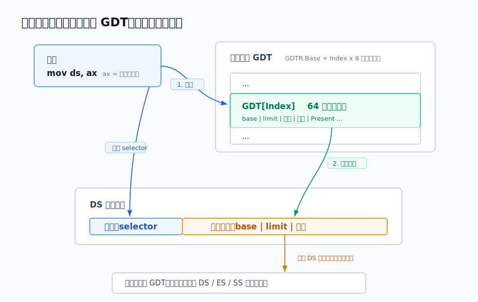

# 二、保护模式的段：选择子、GDT，与那张 64 位的段描述符

---

> **系列说明**：这是"x86 的内存管理是怎么一步步演进来的"系列第二篇。整个系列想把三样东西从 **CPU 硬件的视角**讲透：**段寄存器机制**、**GDT / TSS 这些 CPU 层面的表和寄存器**、**页表的硬件翻译机制**。主线是一条演进史——从 1978 年的 8086，到 80386 的保护模式，再到今天的 x86-64。
>
> 六篇的安排是：第一篇 8086 实模式的段寄存器（为什么会有"段"这东西）；**第二篇（本文）** 保护模式的段（选择子、GDT、段描述符的位结构）；第三篇 特权级与门，以及 TSS 当年的"本来用途"；第四篇 x86-64 的简化（段基本废弃，FS/GS 为什么留下）；第五篇 内核里的 GS / swapgs 与现代 TSS；第六篇 页表的 CPU 机制（CR3、page walk、PTE、KPTI）。

---

上一篇我们把 8086 的段寄存器扒了个底朝天，结论很朴素：实模式下，**段寄存器里装的就是段基址本身**，CPU 拿过来左移 4 位、加上偏移，就是物理地址。没有检查、没有表、没有权限。任何程序都能往 CS 写任何值，然后访问 1MB 里的任何一个字节——包括别人的代码、数据，甚至 BIOS。

这套裸奔模式，在单任务的 DOS 年代还能凑合。但一旦要同时跑多个程序、要让操作系统挡住乱来的应用，它就彻底不够用了。于是 80286、特别是 80386，给段寄存器来了一次彻底变身：进入**保护模式**后，段寄存器里装的**不再是段基址**，而是一个叫**选择子（selector）**的编号。CPU 拿这个编号去查一张表（GDT），表里那条 **64 位的段描述符**才真正记着这个段的基址、有多大、需要什么权限才能碰。

这一篇就把这套新机制拆开：选择子的位结构、GDT 长什么样、那张 64 位描述符逐位是什么意思，以及上一篇结尾预告的"隐藏缓存"是怎么在保护模式下转正成主角的。最后我们在真机上把这套东西跑一遍——加载一个选择子，dump 出 CPU 查表缓存下来的结果，再故意触发一次保护错误，看硬件怎么当场拦住。

> **实验环境**：和第一篇同一套。我这台是 arm64 的 Mac，靠 Docker 拉一个 x86-64 容器（`--platform linux/amd64`，底层走 QEMU 模拟），里面装了 `nasm` + `qemu-system-i386` + `gcc`。镜像叫 `x86lab`，构建方式在第一篇文末，这篇直接复用。本文要写一段引导扇区：先建好 GDT，切进保护模式，往段寄存器里加载选择子，然后停机，用 QEMU monitor 的 `info registers` 把段寄存器的隐藏部分 dump 出来。另外那张"段描述符逐位"，我写了一个可移植的 C 解码器 `gdt.c`，任意机器 `gcc gdt.c -o gdt && ./gdt` 都能复现，输出和 QEMU 的 dump 一一对得上。完整代码和复现命令在文末附录。

## 一、问题变了：不再是"位数不够"，而是"管不住"

先说清楚一件事：保护模式的段，要解决的问题和 8086 **完全不是一回事**了。

8086 的段，纯粹是为了"凑高位"——16 位寄存器够不着 1MB 内存，拿两个寄存器拼。那是个**寻址**问题。

到了 80386，寄存器已经是 **32 位**了，一个寄存器就能数到 `2^32 = 4GB`，寻址早就不是问题。这时候还留着"段"，要解决的是另一个完全不同的麻烦：**怎么管住程序，别让它乱碰内存。**

具体说，操作系统想要这么几件事：

- **边界**：一个程序的代码段就这么大，它读写不该越过这个范围。越界要能被**当场拦住**。
- **权限**：代码段只能执行、不能被当数据写；某些内存只有操作系统（高特权级）能碰，应用程序（低特权级）碰了要报错。
- **隔离**：A 程序的段和 B 程序的段，物理上分开，互相够不着。

这些东西，实模式那套"段寄存器=段基址、CPU 直接左移相加"根本提供不了——因为段寄存器里只有一个基址，**没地方记"这个段多大""谁能访问"**。

Intel 的解法是给每个段配一份"档案"。这份档案里写齐了：段从哪开始（base）、有多大（limit）、是代码还是数据、要多高的权限才能访问（DPL）……这份档案就叫**段描述符（segment descriptor）**，它是一个 **64 位（8 字节）**的结构。所有段的描述符排成一张表，叫 **GDT（Global Descriptor Table，全局描述符表）**。

而段寄存器呢？它不再装基址了，改装一个**指向这张表第几项**的编号——这就是**选择子**。

```
   实模式                               保护模式
   ┌──────────────┐                     ┌──────────────┐
   │   段寄存器   │                     │   段寄存器   │
   │  [ 段基址 ]  │ ──<<4──►            │  [ 选择子 ]  │ ──查表──►
   └──────────────┘ 物理地址            └──────────────┘ 段描述符
   段值本身就是基址                     段值是个编号
   CPU 直接拿来算                       CPU 拿它去 GDT 查      │
                                                               ▼
                                                      ┌─────────────────┐
                                                      │ base/limit/权限 │
                                                      └─────────────────┘
                                                      描述符里才记着真正的基址
```

这是整个 x86 演进里**最大的一次转身**：段寄存器从"直接存基址的数"，变成了"查表的索引"。理解了这一步，后面 TSS、特权级、乃至 x86-64 为什么能把段"基本废掉"，才都有了根。

## 二、选择子：段寄存器里那 16 位，被拆成了三段

先看段寄存器里现在装的"选择子"。它还是 **16 位**（和实模式段寄存器一样宽），但这 16 位不再是一个整体的基址，而是被**拆成三个字段**：

```
   选择子（16 位）的位结构：

    15                          3 2    1   0
   ┌─────────────────────────────┬───┬───────┐
   │        Index (13 位)        │TI │  RPL  │
   └─────────────────────────────┴───┴───────┘
   描述符在表里的下标             │    RPL（2 位）
                                  │
                             TI=0 查 GDT
                             TI=1 查 LDT
```

- **Index（高 13 位）**：描述符在表里的**下标**。13 位能表示 `2^13 = 8192` 个，所以一张表最多 8192 个段描述符。
- **TI（Table Indicator，第 2 位）**：查哪张表。`TI=0` 查 GDT（全局表），`TI=1` 查 LDT（局部表，每个任务一张，下面会提）。
- **RPL（Requested Privilege Level，低 2 位）**：请求特权级，0~3。这个字段和"权限检查"有关，是第三篇特权级的重头戏，这里先只认识它占了最低 2 位。

关键的一个细节：**Index 是从第 3 位开始的，低 3 位（TI + RPL）不算下标。** 所以一个选择子的数值，和它指向第几项，差了 8 倍（2^3）。换句话说：

```
   选择子 = (Index << 3) | (TI << 2) | RPL

   三个字段各占自己的位:Index 在高 13 位、TI 在第 2 位、
   RPL 在低 2 位,拼起来就是这 16 位的选择子。

   注意 Index 是"左移 3 位"后才落到选择子里的,所以反过来取
   下标要"右移 3 位":Index = 选择子 >> 3。
   而 Index<<3 在数值上正好等于 Index×8——因为每个描述符是
   8 字节,这一步无意中就把下标变成了"描述符在表里的字节偏移"
   (CPU 用 GDTR.Base + (选择子 & ~7) 定位描述符)。低 3 位腾给
   TI/RPL,不参与寻址,8 字节对齐天然成立。设计得很巧。
```

来看几个最常见的选择子，反推它们指向哪：

```
   选择子 0x08 = 二进制 0000_0000_0000_1000
                 Index = 0x08 >> 3 = 1，TI=0，RPL=0
                 → GDT 第 1 项，特权级 0

   选择子 0x10 = 0000_0000_0001_0000
                 Index = 0x10 >> 3 = 2，TI=0，RPL=0
                 → GDT 第 2 项

   选择子 0x18 = Index = 3 → GDT 第 3 项

   选择子 0x03 = 0000_0000_0000_0011
                 Index = 0，TI=0，RPL=3
                 → GDT 第 0 项，特权级 3
```

这就是为什么内核代码里你总看到 `0x08`、`0x10` 这种"跳着 8"的选择子值——它们的 Index 左移 3 位(`Index << 3`)后,数值上就成了 1×8、2×8……第 0 项(选择子 0x00,Index=0)有个特殊约定：**GDT 的第 0 项必须是"空描述符"（全 0），不能用。** 加载选择子 0（且要真正访存）会触发错误。这是 Intel 故意留的一道保险，防止程序员忘了初始化段寄存器（默认是 0）就拿去访存。

> **GDT vs LDT 一句话**：GDT 是全局唯一的一张表，存放所有任务共享的段（内核代码/数据段等）。LDT 是"局部描述符表"，设计初衷是每个任务一张、存自己私有的段，靠 TI=1 来选。但实际上，现代操作系统（Linux 在内）**几乎不用 LDT**——平坦内存模型下大家共享 GDT 里那几个段就够了。LDT 和它的伙伴 LDTR 寄存器，我们第三篇连同 TSS 一起讲它当年的"本来用途"和为什么被冷落。这一篇所有例子都走 GDT（TI=0）。

## 三、GDTR：CPU 怎么知道 GDT 在哪

选择子说"我要表里第几项"，可 CPU 得先知道**这张表本身在内存的哪个位置**。这个信息存在一个专门的寄存器里：**GDTR（GDT Register）**。

GDTR 是个 **48 位**的寄存器（保护模式下），装两样东西：

```
   GDTR（48 位）：

   ┌────────────────────────────┬──────────────────┐
   │       Base（32 位）        │  Limit（16 位）  │
   │   GDT 在内存里的起始地址   │   表的大小减 1   │
   └────────────────────────────┴──────────────────┘
```

- **Base**：GDT 在线性地址空间里的起始地址（32 位）。
- **Limit**：表的字节长度**减 1**。比如表里有 N 个描述符，每个 8 字节，Limit = N×8 − 1。

为什么是"减 1"？因为这样 Limit=0 表示"1 个字节"，能表示的最大范围正好覆盖到 `0xFFFF` 项满。这种"长度减一"的编码在 x86 里到处都是（段 limit 也是），习惯就好。

CPU 怎么用这俩拼出"第 i 个描述符的地址"？

```
   第 Index 个描述符的线性地址 = GDTR.Base + Index × 8

   （Index×8 就是选择子高 13 位的天然含义——见上一节）
```

加载 GDTR 用一条专门的指令 `lgdt`，它从内存里读 6 字节（2 字节 limit + 4 字节 base）填进 GDTR。这条指令是特权指令，只有操作系统（最高特权级）能执行——总不能让应用程序自己改"段表在哪"，那保护就没意义了。

一会儿实测时，我们会 dump 出 GDTR，亲眼看到它的 base 和 limit。

## 四、主角登场：64 位的段描述符，逐位拆开

现在到了最硬核、也最关键的部分：那张表里每一项——**64 位的段描述符**——到底长什么样。

这 8 个字节，是 Intel 为了向后兼容硬塞出来的，字段排布得**非常零碎**：base 被切成三段塞在不同位置，limit 被切成两段。第一次看会觉得乱，但每一位都有它的来历。先上全图：

```
   段描述符（64 位 / 8 字节），按 bit 从高到低：

    63          56 55  52 51  48 47         40 39        32
   ┌─────────────┬───────┬───────┬─────────────┬─────────────┐
   │ Base 31:24  │ Flags │ Limit │   Access    │ Base 23:16  │
   │   (8 位)    │(4 位) │ 19:16 │ Byte(8 位)  │   (8 位)    │
   └─────────────┴───────┴───────┴─────────────┴─────────────┘
    31                          16 15                      0
   ┌────────────────────────────┬────────────────────────────┐
   │     Base 15:0 (16 位)      │     Limit 15:0 (16 位)     │
   └────────────────────────────┴────────────────────────────┘

   拼起来的逻辑字段：
     Base  = Base31:24 : Base23:16 : Base15:0      → 32 位段基址
     Limit = Limit19:16 : Limit15:0                → 20 位段界限
     Access Byte（8 位）= P DPL S | E DC RW A      → 类型与权限
     Flags（4 位）      = G DB L AVL               → 粒度等
```

为什么 base 和 limit 被切得稀碎？历史原因：80286 的描述符里 base 只有 24 位、limit 只有 16 位（占了低 6 字节）。到 80386 要扩到 32 位 base、20 位 limit，可低 6 字节的格式不能动（要兼容 286），只能把多出来的位**见缝插针**塞进高 2 字节的空隙里。于是就有了 base 三段、limit 两段这种拼图。

下面把两个最要紧的复合字段——**Access Byte** 和 **Flags**——再放大。

### Access Byte（访问字节）：类型和权限都在这 8 位里

```
   Access Byte（bit 47:40）：

    7   6   5   4   3   2   1   0
   ┌───┬───────┬───┬───┬───┬───┬───┐
   │ P │  DPL  │ S │ E │DC │RW │ A │
   └───┴───────┴───┴───┴───┴───┴───┘
```

- **P（Present，第 7 位）**：这个段在不在内存里。P=0 表示段不存在，访问它会触发 #NP（段不存在）异常。这是后来做"段交换"用的，平时都置 1。
- **DPL（Descriptor Privilege Level，第 6~5 位）**：描述符特权级，0~3。**这个段需要多高的权限才能访问**。0 是最高（内核），3 是最低（用户）。这是特权保护的核心，第三篇细讲。
- **S（第 4 位）**：S=1 表示这是"代码段或数据段"（普通段）；S=0 表示这是"系统段"（如 TSS、LDT、各种门）。这一篇都是 S=1 的普通段，S=0 的系统段留给第三篇。
- **E（Executable，第 3 位）**：S=1 时，E=1 是**代码段**，E=0 是**数据段**。这一位决定了下面 DC/RW 两位的含义。
- **DC、RW、A**：含义随 E 而变：
  - **数据段（E=0）**：DC=方向（0 向上扩展，1 向下扩展，栈段用），RW=**是否可写**（0 只读，1 可读写；数据段永远可读），A=accessed（CPU 访问过置 1）。
  - **代码段（E=1）**：DC=一致性（conforming），RW=**是否可读**（0 只能执行，1 可读可执行；代码段永远不可写），A=accessed。

所以你看几个经典的 Access Byte 值：

```
   0x9A = 1001_1010
          P=1 DPL=00 S=1 | E=1 DC=0 R=1 A=0
          → 存在、特权级0、普通段、代码段、可读、非一致
          这就是内核代码段

   0x92 = 1001_0010
          P=1 DPL=00 S=1 | E=0 DC=0 W=1 A=0
          → 存在、特权级0、普通段、数据段、可写、向上扩展
          这就是内核数据段

   0xFA = 1111_1010  → DPL=11（特权级3）的代码段 → 用户代码段
   0xF2 = 1111_0010  → DPL=11 的数据段           → 用户数据段
```

内核里那几个段的 Access Byte，翻来覆去就这几个值。

### Flags（4 位）：粒度，以及"这是 16 位还是 32 位段"

```
   Flags（bit 55:52）：

    3   2   1   0
   ┌───┬───┬───┬───┐
   │ G │DB │ L │AVL│
   └───┴───┴───┴───┘
```

- **G（Granularity，粒度，第 3 位）**：最重要的一位。决定 limit 的**单位**。
  - G=0：limit 以**字节**为单位，段最大 `2^20 = 1MB`。
  - G=1：limit 以 **4KB（一页）**为单位，段最大 `2^20 × 4KB = 4GB`。

  这就是怎么用 20 位的 limit 字段表示 4GB 的段：G=1 时，limit 这个数要乘 4096。所以一个 limit=0xFFFFF、G=1 的段，实际大小 = `(0xFFFFF + 1) × 4096 = 4GB`，正好覆盖整个 32 位地址空间。

- **DB（第 2 位）**：D/B 位。代码段里它是 D（默认操作数/地址宽度，1=32 位，0=16 位）；数据段（栈）里它是 B。简单理解：**1 = 32 位段，0 = 16 位段**。
- **L（Long mode，第 1 位）**：64 位代码段标志。L=1 表示这是 x86-64 的 64 位代码段（这时 DB 必须为 0）。32 位保护模式下 L=0。这一位是第四、五篇 x86-64 的伏笔。
- **AVL（第 0 位）**：留给操作系统自己用，CPU 不管。

### 用一段 C 程序把描述符逐位解出来

光看图容易晕。我写了个解码器 `gdt.c`，把一个 64 位描述符按上面的规则拆开打印——这段在任意机器上 `gcc` 都能跑，不依赖 x86：

```c
#include <stdio.h>
#include <stdint.h>

// 把一个 64 位段描述符按 Intel 手册逐位拆开
static void decode(const char *name, uint64_t d){
    // 界限 limit：低 16 位 + 高 4 位（在 bit48..51）
    uint32_t limit = (uint32_t)(d & 0xFFFF) | (uint32_t)(((d >> 48) & 0xF) << 16);
    // 基址 base：bit16..39（低24位）+ bit56..63（高8位）
    uint32_t base  = (uint32_t)((d >> 16) & 0xFFFFFF) | (uint32_t)(((d >> 56) & 0xFF) << 24);
    uint8_t access = (d >> 40) & 0xFF;   // access byte
    uint8_t flags  = (d >> 52) & 0xF;    // G/DB/L/AVL

    int P   = (access >> 7) & 1;
    int DPL = (access >> 5) & 3;
    int S   = (access >> 4) & 1;
    int E   = (access >> 3) & 1;   // 1=代码段
    int DC  = (access >> 2) & 1;
    int RW  = (access >> 1) & 1;
    int A   = (access >> 0) & 1;
    int G   = (flags >> 3) & 1;    // 粒度：1=4KB
    int DB  = (flags >> 2) & 1;    // 1=32位
    int L   = (flags >> 1) & 1;

    unsigned long bytes = G ? ((unsigned long)limit + 1) << 12
                            : ((unsigned long)limit + 1);

    printf("%s  描述符 = 0x%016llX\n", name, (unsigned long long)d);
    printf("    base   = 0x%08X\n", base);
    printf("    limit  = 0x%05X  (G=%d -> 实际 %lu 字节 = %s)\n",
           limit, G, bytes, G ? "4GB" : "");
    printf("    access = 0x%02X : P=%d DPL=%d S=%d  %s  %s%s A=%d\n",
           access, P, DPL, S,
           E ? "代码段(E=1)" : "数据段(E=0)",
           E ? (RW ? "可读R=1" : "只执行R=0") : (RW ? "可写W=1" : "只读W=0"),
           E ? (DC ? " 一致C=1" : " 非一致C=0") : (DC ? " 向下扩展" : " 向上扩展"),
           A);
    printf("    flags  = 0x%X  : G=%d(粒度) DB=%d(%s) L=%d\n\n",
           flags, G, DB, DB ? "32位" : "16位", L);
}

int main(void){
    decode("GDT[1] 代码段", 0x00CF9A000000FFFFULL);
    decode("GDT[2] 数据段", 0x00CF92000000FFFFULL);
    decode("GDT[3] 数据段", 0x00CF92400000FFFFULL);  // base = 0x00400000
    return 0;
}
```

跑出来（真实输出）：

```
GDT[1] 代码段  描述符 = 0x00CF9A000000FFFF
    base   = 0x00000000
    limit  = 0xFFFFF  (G=1 -> 实际 4294967296 字节 = 4GB)
    access = 0x9A : P=1 DPL=0 S=1  代码段(E=1)  可读R=1 非一致C=0 A=0
    flags  = 0xC  : G=1(粒度) DB=1(32位) L=0

GDT[2] 数据段  描述符 = 0x00CF92000000FFFF
    base   = 0x00000000
    limit  = 0xFFFFF  (G=1 -> 实际 4294967296 字节 = 4GB)
    access = 0x92 : P=1 DPL=0 S=1  数据段(E=0)  可写W=1 向上扩展 A=0
    flags  = 0xC  : G=1(粒度) DB=1(32位) L=0

GDT[3] 数据段  描述符 = 0x00CF92400000FFFF
    base   = 0x00400000
    limit  = 0xFFFFF  (G=1 -> 实际 4294967296 字节 = 4GB)
    access = 0x92 : P=1 DPL=0 S=1  数据段(E=0)  可写W=1 向上扩展 A=0
    flags  = 0xC  : G=1(粒度) DB=1(32位) L=0
```

注意 GDT[1] 和 GDT[2]：base 都是 0、limit 都是 4GB。这就是著名的**平坦模型（flat model）**——代码段和数据段都从 0 开始、都覆盖整个 4GB。这么一来，逻辑地址（段:偏移）里的偏移，和线性地址几乎就相等了，段在寻址上**形同透明**。现代操作系统全这么干。"段还在，但被摊平到不起作用"，这是第四篇 x86-64 把段进一步废掉的起点。

GDT[3] 我故意把 base 设成 `0x00400000`，就是为了等会儿在真机 dump 里，能一眼认出"选择子 → 这个 base"的对应关系。

## 五、隐藏缓存转正：选择子查一次表，结果存进影子寄存器

上一篇结尾我埋了个伏笔：实模式下段寄存器有个"隐藏部分"（descriptor cache），那时它只是个存 `段值<<4` 的小跟班。现在它要转正成主角了。

想一个性能问题：如果每次访存都要"拿选择子 → 去内存里的 GDT 查 → 读出 8 字节描述符 → 解析出 base/limit/权限"，那太慢了——每条访存指令都多好几次内存读。

CPU 的办法是：**只在你往段寄存器加载选择子的那一刻，查一次表。** 查出来的描述符（base、limit、权限那一整套），立刻缓存进段寄存器的**隐藏部分**（也叫影子寄存器 / descriptor cache）。之后只要这个段寄存器的选择子不变，每次访存就直接用缓存里的 base/limit，**不再碰 GDT**。



这就解释了一个常见的困惑：**你改了 GDT 里某项的内容，但已经加载了那个选择子的段寄存器不会自动更新**——因为它用的是早就缓存好的隐藏部分。必须重新 `mov` 一次选择子，才会触发重新查表、刷新缓存。

也正因为这个缓存，实测时我们能直接 dump 段寄存器，把 CPU 查表的结果看得一清二楚。

## 六、真机实测：选择子 → GDT → 隐藏 base，全程看一遍

理论铺完，上真机。我们写一段引导扇区，干这么几件事：建一张 4 项的 GDT、用 `lgdt` 装进 GDTR、打开保护模式、往段寄存器加载选择子，然后停机，dump 出来看。

GDT 里 GDT[3] 的 base 我设成了 `0x00400000`（就是上面解码器里那项），这样在 dump 里就能验证"选择子 0x18 加载后，隐藏 base 确实变成了 0x00400000"。

```asm
; pm.asm —— 引导扇区：实模式 -> 保护模式，加载选择子
BITS 16
org 0x7c00
start:
    cli
    xor ax, ax
    mov ds, ax
    mov es, ax
    mov ss, ax
    mov sp, 0x7c00

    lgdt [gdt_desc]          ; 加载 GDTR：base + limit

    mov eax, cr0
    or  eax, 1               ; CR0.PE = 1，开启保护模式
    mov cr0, eax

    jmp 0x08:pm_entry        ; 远跳，选择子 0x08=GDT[1] 代码段，刷新 CS

BITS 32
pm_entry:
    mov ax, 0x10             ; 选择子 0x10 = GDT[2] 数据段
    mov ds, ax
    mov ax, 0x18             ; 选择子 0x18 = GDT[3]，base=0x00400000
    mov es, ax
    mov ax, 0x10
    mov ss, ax
    mov esp, 0x90000
.hang:
    hlt
    jmp .hang

align 8
gdt_start:
    dq 0x0000000000000000   ; [0] 空描述符（必须）
    dq 0x00CF9A000000FFFF   ; [1] 0x08 代码段 base=0 limit=4GB
    dq 0x00CF92000000FFFF   ; [2] 0x10 数据段 base=0 limit=4GB
    dq 0x00CF92400000FFFF   ; [3] 0x18 数据段 base=0x00400000
gdt_end:
gdt_desc:
    dw gdt_end - gdt_start - 1   ; limit
    dd gdt_start                 ; base
times 510-($-$$) db 0
dw 0xaa55
```

有两个点值得停一下：

1. **打开保护模式就是 `CR0` 最低位（PE，Protection Enable）置 1。** 就这么一位。置 1 那一刻，CPU 对段寄存器的解释方式立刻从"基址"变成"选择子"。
2. **`jmp 0x08:pm_entry` 那个远跳不是可有可无的。** 开了 PE 之后，CS 里还是实模式残留的旧值，必须用一次远跳"重新加载 CS"，让 CPU 用新选择子 0x08 去查 GDT、刷新 CS 的隐藏部分，才算真正进入 32 位保护模式执行。这正是上一节"加载选择子才触发查表"的现场应用。

跑起来，dump 段寄存器（真实输出）：

```
ES =0018 00400000 ffffffff 00cf9300 DPL=0 DS   [-WA]
CS =0008 00000000 ffffffff 00cf9a00 DPL=0 CS32 [-R-]
SS =0010 00000000 ffffffff 00cf9300 DPL=0 DS   [-WA]
DS =0010 00000000 ffffffff 00cf9300 DPL=0 DS   [-WA]
```

逐列对照（以 ES 那行为例，QEMU 的格式和第一篇一样：选择子 / 隐藏 base / 隐藏 limit / 隐藏属性）：

```
   ES   =   0018      00400000    ffffffff    00cf9300
            ┌┘        ┌┘          ┌┘          ┌┘
           ①选择子   ②隐藏 base  ③隐藏 limit  ④隐藏属性
           mov 进    查 GDT      段多大       access
           的值      得来        展开后       /flags

   ① 0018     = 我们加载的选择子，Index=3 → GDT[3]
   ② 00400000 = 正是 GDT[3] 描述符里的 base！CPU 查表填进来的
   ③ ffffffff = limit=0xFFFFF 配 G=1，展开成 4GB-1 = 0xFFFFFFFF
   ④ 00cf9300 = 属性，0x93/0x9a 等（和描述符的 access/flags 对应）
```

**重点就在第②列：选择子是 `0x18`，可隐藏 base 是 `0x00400000`——这个值我们没在汇编里直接写进 ES，它是 CPU 拿选择子 0x18 去 GDT[3] 查出来、自动缓存进隐藏部分的。** 这就是第五节那张图的真实回放：`mov es, 0x18` 触发了一次查表，描述符的 base 落进了 ES 的影子寄存器。

CS=0008 → base=0（GDT[1]），DS/SS=0010 → base=0（GDT[2]），全都对得上。注意 QEMU 还贴心地把属性翻译成了 `CS32`（32 位代码段）、`DS [-WA]`（可写数据段、已访问）这种人话，和我们解码器的输出是一个意思。

再 dump 一下 GDTR，确认那张表确实在我们放的地方：

```
GDT=     00007c40 0000001f
```

base=`0x00007c40`（GDT 在 bootsector 里 `gdt_start` 那个位置），limit=`0x1f`=31=`4×8−1`，正好 4 个描述符。和源码完全吻合。

> 把这个 dump 和上一篇实模式的 dump 摆一起看，演进就具象了。实模式：ES=0xb800 → 隐藏 base=0xb8000，base 是选择子**自己左移 4 位**算的。保护模式：ES=0x0018 → 隐藏 base=0x00400000，base 是**从 GDT 查出来的任意值**，和选择子数值之间再没有 `<<4` 那种算术关系了。同一个隐藏寄存器，喂给它的东西从"段值<<4"变成了"GDT 里查到的描述符"——这就是第一篇说的"小跟班转正成主角"。

### 把整条链路走一遍：一行 `mov` 是怎么落到具体内存地址的

上面的 dump 把每个环节单独验证了，现在把它们串成一条完整的链。假设我们执行这么一行——读 ES 段内偏移 `0x100` 处的 4 字节（ES 此刻装的就是上面那个选择子 `0x0018`、GDT 也还是那张表）：

```asm
    mov eax, [es:0x100]
```

这条链路可以拆成两段看：加载 ES 时，GDTR 先告诉 CPU「表在哪」，选择子再说「要表里第几条」，命中的描述符把 base 填进 ES 的隐藏缓存；真正执行这条 `mov` 时，CPU 直接拿 ES 缓存里的 base 加上偏移，落到具体内存（图里每个数字都是上面 dump 出来的真实值）：

![保护模式下 mov eax, [es:0x100] 的地址形成过程](assets/protected-mode-mov-address.svg)

一步步说清楚：

1. **GDTR 指出表在哪。** GDT 是放在**内存**里的一张表，CPU 怎么知道它在哪？就靠 GDTR 这个寄存器：它的 Base 字段 `0x00007C40` 就是这张表的**首地址**，Limit `0x1F` 说明表一共 `0x20` 字节、正好 4 条描述符。dump 出来的 `GDT= 00007c40 0000001f` 就是这两个值。
2. **选择子说要第几条。** 指令里 `es` 给的是选择子 `0x0018`，取高 13 位得 Index=3。第 3 条描述符的地址 = `GDTR.Base + Index×8 = 0x7C40 + 3×8 = 0x7C58`，正好落在表里 GDT[3] 那一格。
3. **命中描述符并刷新 ES 隐藏缓存。** 加载 ES 时，CPU 去 `0x7C58` 读出 8 字节 `0x00CF92400000FFFF`，这就是 GDT[3]，再从里面解出 `base = 0x00400000`，缓存进 ES 的隐藏部分。
4. **执行 `mov` 时落到内存。** 这条访存不再重新读 GDT，而是直接拿 ES 隐藏缓存里的 `base = 0x00400000`，加上指令偏移 `0x100`，得到**线性地址** `0x00400100`。没开分页时它就是物理地址，CPU 直接去这儿取数；开了分页则再过一层页表（第六篇）。

这张图把第三节的 GDTR、第四节的描述符、第二节的选择子三样东西**摆在了它们真实的位置关系上**：GDTR 在 CPU 里、用一根"指针"指向内存中那张连续排放的 GDT 表，选择子则是"取这张表第几格"的下标。

对比一下第一篇实模式的同一条链：那里 `ES:0x100` 是 `ES<<4 + 0x100`，ES 里就是基址、左移 4 位直接算，没有 GDTR、没有内存里的表、没有描述符。保护模式把中间硬生生插进了"**GDTR 定位表 → 选择子选中某条 → 取出 base**"这一整段——多出来的这几步，换来的就是 base 可以是任意值（不再被 `<<4` 绑死）、外加 limit 和权限检查。**这就是"段寄存器从'基址'变成'查表钥匙'"在一条指令里的完整体现。**

## 七、保护是真的：故意越权，看硬件当场拦下

讲了半天"边界""权限"，它们到底是不是真的被硬件执行了？我们来故意犯规，看 CPU 会不会拦。

为了能**看见**拦截的结果（而不是机器直接重启），我额外做了一张极简的 **IDT（中断描述符表）**，只挂了一个 13 号向量的处理程序——13 号就是 **#GP（General Protection，一般保护错误）**，几乎所有段违规都报它。

这个处理程序只干两件事：先执行 `mov eax, 0xDEAD`，再 `hlt` 停机。`0xDEAD` 没有什么特殊硬件含义，它只是我人为写进去的一个标记。后面用 QEMU dump 寄存器时，如果看到 `EAX=0xDEAD`，就说明 CPU 确实因为违规跳进了我们的 #GP 处理程序；如果没跳进去，EAX 就不会被这个处理程序改成 `0xDEAD`。

处理程序本身最小可以写成这样：

```asm
gp_handler:
    mov eax, 0x0000DEAD    ; 留一个标记：我确实进过 #GP 处理程序
    hlt                    ; 停住，方便 QEMU dump 寄存器
```

> 先说一个实测中踩到的坑，免得你复现时困惑：**QEMU 的 TCG 模拟并不严格执行"数据段 limit 越界"的检查**——我试过把一个段的 limit 设成 16 字节，然后去读偏移 0x1000，本该 #GP，结果 QEMU 放行了。这是模拟器为性能做的简化，真实硬件会拦。但 QEMU **严格执行"加载选择子时"的各种检查**（选择子越界、类型不符、特权不够、P=0 等）。所以下面几个实验都选 **load-time（加载选择子那一刻）**的违规，这类 QEMU 和真机行为一致，能稳定复现。

**违规一：加载一个超出 GDT 范围的选择子。** 我们的 GDT 只有 4 项，也就是合法 Index 只有 0、1、2、3（最后一个有效选择子是 `0x18`）。现在故意加载选择子 `0x30`（Index=6，表里根本没有这项）：

```asm
    mov dx, 0x30           ; 选择子 0x30 = Index 6，但 GDT 只有 Index 0..3
    mov es, dx             ; 加载越界选择子 -> CPU 当场 #GP
    mov eax, 0x33333333    ; 若执行到这，说明没拦住（不应发生）
```

跑完 dump（真实输出）：

```
EAX=0000dead EBX=00000000 ECX=00000000 EDX=00000030
EIP=00007c49 ...  HLT=1
```

`EAX=0x0000DEAD`——处理程序跑了！EDX 还停在 `0x30`（我们试图加载的那个非法选择子），而那条 `mov eax, 0x33333333` **从没执行**（否则 EAX 早被覆盖）。也就是说，`mov es, 0x30` 这条指令在 CPU 内部就**查了 GDTR.limit、发现 Index 越界、当场抛 #GP**，控制流被夺走、跳进了 13 号处理程序。这就是 GDTR 里那个 limit 字段的作用——它不是摆设，CPU 真的拿它卡边界。

**违规二：把一个"只能执行的代码段"装进 SS。** 规则是 SS（栈段）必须是**可写的数据段**。我们偏把代码段选择子 `0x08`（只执行、不可写）装进 SS：

```asm
    mov dx, 0x08           ; 0x08 = 只执行代码段（不可写）
    mov ss, dx             ; 把不可写的段装进 SS -> CPU 当场 #GP
    mov eax, 0x33333333    ; 不应执行到
```

dump（真实输出）：

```
EAX=0000dead EBX=00000000 ECX=00000000 EDX=00000008
EIP=00007c49 ...  HLT=1
```

又是 `EAX=0xDEAD`。CPU 在加载 SS 时**检查了描述符的类型位**（这是代码段还是可写数据段？），发现类型不对，抛 #GP。这正是第四节 Access Byte 里 S/E/RW 那几位的现场执法——它们不只是"描述",CPU 会拿去做强制检查。

**违规三：内存里有那条描述符，但它在 GDTR.limit 外。** 这个实验专门验证“不是内存里有没有那 8 字节”，而是 CPU 会不会严格看 GDTR.limit。我们在 GDT 后面额外放上 GDT[4]、GDT[5]、GDT[6]，其中 GDT[6] 的选择子正好是 `0x30`；但 GDTR.limit 仍然只填 `0x1f`，只允许 CPU 使用 GDT[0..3]。

```asm
gdt_start:
    dq 0x0000000000000000    ; [0]
    dq 0x00CF9A000000FFFF    ; [1]
    dq 0x00CF92000000FFFF    ; [2]
    dq 0x00CF92400000FFFF    ; [3]
gdt_limit_end:
    dq 0x00CF92000000FFFF    ; [4] 在内存里，但 limit 不覆盖
    dq 0x00CF92000000FFFF    ; [5] 在内存里，但 limit 不覆盖
    dq 0x00CF92000000FFFF    ; [6] 选择子 0x30 会指到这里

gdt_desc:
    dw gdt_limit_end - gdt_start - 1  ; limit 仍然是 0x1f
    dd gdt_start
```

然后还是执行：

```asm
    mov dx, 0x30             ; Index=6，描述符偏移 0x30
    mov es, dx               ; 虽然内存里有 GDT[6]，但它在 limit 外 -> #GP
```

这次 dump 仍然是 `EAX=0xDEAD`，同时能看到 `GDT= ... 0000001f`。`0x30 & ~7 = 0x30`，一条描述符要读 8 字节，范围是 `0x30..0x37`，明显超过 GDTR.limit=`0x1f`。所以这个实验验证的是：**CPU 访问 GDT 描述符之前，会先用 GDTR.limit 卡住表边界；limit 外哪怕真的有描述符，也不能用。**

三个实验合起来说明一件事：**保护模式的"保护"是硬件实打实执行的。** 选择子的 Index 要在 GDTR.limit 之内、装进某个段寄存器的描述符类型要匹配它的用途、特权级要够——任何一条不满足，CPU 在加载选择子的那一拍就抛异常，把控制权交给操作系统的处理程序。8086 那种"往段寄存器写啥都行、写完随便访存"的裸奔，到这里彻底结束了。

## 八、收尾：段寄存器从"基址"变成了"查表的钥匙"

把这一篇收一下。从实模式到保护模式，段这套机制经历了一次脱胎换骨：

- **动机变了**：8086 的段是为了"凑高位、够到 1MB"，是个寻址问题；保护模式的段是为了"管住程序"——边界、权限、隔离，是个保护问题。32 位寄存器早就不缺寻址能力了。
- **段寄存器变了**：里面装的不再是段基址，而是 16 位的**选择子**（Index 13 位 + TI 1 位 + RPL 2 位）。它是"GDT/LDT 里第几项"的编号，本身不含基址。
- **多了一张表和一个寄存器**：所有段的"档案"（64 位段描述符）排成 **GDT**，由 **GDTR**（base+limit）告诉 CPU 它在哪。描述符里逐位写齐了 base（32 位，切三段）、limit（20 位，切两段，配 G 位决定单位）、Access Byte（P/DPL/S/E/DC/RW/A）、Flags（G/DB/L/AVL）。
- **隐藏缓存转正**：加载选择子时 CPU 查一次表，把描述符缓存进段寄存器的隐藏部分（影子寄存器），之后访存直接用，不再查表。第一篇里那个存 `段值<<4` 的小跟班，在这里变成了缓存整个描述符的主角。
- **保护是真的**：实测里加载越界选择子、把不可写段装进 SS，都被 CPU 在加载那一刻当场 #GP 拦下——GDTR.limit、描述符类型位都是 CPU 强制执行的，不是文档说说。

但你也许已经注意到，这一篇我们一直回避两个东西：**DPL/RPL 那套特权级到底怎么判定**，以及描述符里 S=0 的那些"系统段"（TSS、LDT、各种门）是干嘛的。这俩恰恰是保护模式"保护"二字的另一半——前者管"谁有资格访问",后者管"怎么安全地从低特权级跨进高特权级"。

> 下一篇我们就专门讲**特权级与门**：CPL/RPL/DPL 三个特权级是怎么参与每一次访问检查的（为什么有三个、它们怎么比大小）、调用门/中断门/陷阱门是干嘛用的，以及那个名字你肯定听过、却很少有人说清它"本来用途"的 **TSS（任务状态段）**——它当年是为 Intel 设想的"硬件任务切换"准备的，为什么 Linux 几乎把那套机制全弃用了、只留它一个角落的字段还在天天用。把这一篇的描述符（S=1 的普通段）和下一篇的系统段（S=0）拼齐，保护模式的段机制就完整了。

## 附：实验环境与完整复现

**1）容器** 和第一篇同一个 `x86lab`（`debian:bookworm` + `nasm` + `qemu-system-x86` + `gcc`），构建方式见第一篇文末。本文 NASM 2.16、QEMU 7.2。

**2）选择子→GDT 实测**（第六节）：把上面的 `pm.asm` 存好，在容器里：

```bash
nasm -f bin pm.asm -o pm.img
qemu-system-i386 -drive format=raw,file=pm.img -display none \
    -monitor tcp:127.0.0.1:4455,server,nowait &
sleep 2
exec 3<>/dev/tcp/127.0.0.1/4455
printf 'info registers\nquit\n' >&3
cat <&3 | grep -iE '^(CS|DS|ES|SS|GDT) '
```

`info registers` 里每个段寄存器的第二列就是隐藏 base，对照选择子 Index 能看到它等于 GDT 对应项的 base。

**3）段描述符解码器**（第四节的 `gdt.c`，任意机器 `gcc gdt.c -o gdt && ./gdt`）：代码见正文第四节，直接拷出来编译即可。改 `main()` 里传给 `decode()` 的 64 位常量，就能解任意一条你好奇的描述符。

**4）保护违规实测**（第七节）：下面是完整的 `pm_gp.asm`。它自己建 GDT、IDT，切进保护模式，然后故意触发 #GP。默认跑“越界选择子”；如果编译时传 `-DFAIL_CASE=2`，就跑“把代码段装进 SS”；传 `-DFAIL_CASE=3`，就跑“内存里有 GDT[6]，但 GDTR.limit 不覆盖它”。

```asm
; pm_gp.asm —— 保护模式下故意触发 #GP，并用 EAX=0xDEAD 标记处理程序跑过
; FAIL_CASE=1：加载越界选择子 0x30 到 ES
; FAIL_CASE=2：把代码段选择子 0x08 加载到 SS
; FAIL_CASE=3：内存里放了 GDT[6]，但 GDTR.limit 不覆盖它

%ifndef FAIL_CASE
%define FAIL_CASE 1
%endif

BITS 16
org 0x7c00

start:
    cli
    xor ax, ax
    mov ds, ax
    mov es, ax
    mov ss, ax
    mov sp, 0x7c00

    lgdt [gdt_desc]          ; GDTR <- GDT 的 base/limit

    mov eax, cr0
    or  eax, 1               ; CR0.PE = 1，开启保护模式
    mov cr0, eax

    jmp 0x08:pm_entry        ; 重新加载 CS，进入 32 位代码段

BITS 32
pm_entry:
    mov ax, 0x10             ; 0x10 = GDT[2]，可写数据段
    mov ds, ax
    mov es, ax
    mov ss, ax
    mov esp, 0x90000

    lidt [idt_desc]          ; IDTR <- 只挂了 #GP 的极简 IDT

%if FAIL_CASE = 1
    mov dx, 0x30             ; Index=6，但这份 GDT 只有 Index 0..3
    mov es, dx               ; 加载越界选择子 -> #GP
%elif FAIL_CASE = 2
    mov dx, 0x08             ; 0x08 = GDT[1]，代码段
    mov ss, dx               ; SS 必须是可写数据段，这里类型不匹配 -> #GP
%elif FAIL_CASE = 3
    mov dx, 0x30             ; Index=6，描述符偏移 0x30，超过 GDTR.limit=0x1f
    mov es, dx               ; 即使内存里放了 GDT[6]，超过 limit 也必须 #GP
%else
%error FAIL_CASE must be 1, 2 or 3
%endif

    mov eax, 0x33333333      ; 如果执行到这里，说明没有被拦住
.hang:
    hlt
    jmp .hang

gp_handler:
    mov eax, 0x0000DEAD      ; 标记：确实进了 #GP 处理程序
    hlt
    jmp $

align 8
gdt_start:
    dq 0x0000000000000000    ; [0] 空描述符
    dq 0x00CF9A000000FFFF    ; [1] 0x08 代码段 base=0 limit=4GB
    dq 0x00CF92000000FFFF    ; [2] 0x10 数据段 base=0 limit=4GB
    dq 0x00CF92400000FFFF    ; [3] 0x18 数据段 base=0x00400000
gdt_limit_end:
%if FAIL_CASE = 3
    ; 下面这些描述符确实放在内存里，但 GDTR.limit 不覆盖它们。
    ; 如果 CPU 不检查 GDTR.limit，0x30 本来会命中 GDT[6]。
    dq 0x00CF92000000FFFF    ; [4] 0x20，故意放在 limit 外
    dq 0x00CF92000000FFFF    ; [5] 0x28，故意放在 limit 外
    dq 0x00CF92000000FFFF    ; [6] 0x30，故意放在 limit 外
%endif

gdt_desc:
    dw gdt_limit_end - gdt_start - 1  ; limit=0x1f，只允许 GDT[0..3]
    dd gdt_start

align 8
idt_start:
    times 13 dq 0            ; 0..12 号向量空着
    dw gp_handler            ; 13 号：#GP gate offset low
    dw 0x08                  ; 代码段选择子
    db 0
    db 0x8E                  ; P=1, DPL=0, 32-bit interrupt gate
    dw 0                     ; offset high；本实验代码都在 0x00007c00 附近
idt_end:

idt_desc:
    dw idt_end - idt_start - 1
    dd idt_start

times 510-($-$$) db 0
dw 0xaa55
```

完整操作步骤如下。先把上面的代码保存成 `pm_gp.asm`，然后在装了 `nasm` 和 `qemu-system-i386` 的环境里执行：

```bash
# 实验 1：加载越界选择子 0x30 到 ES
nasm -f bin -DFAIL_CASE=1 pm_gp.asm -o gp_oob.img
qemu-system-i386 -drive format=raw,file=gp_oob.img -display none \
    -monitor tcp:127.0.0.1:4455,server,nowait &
sleep 2
exec 3<>/dev/tcp/127.0.0.1/4455
printf 'info registers\nquit\n' >&3
cat <&3 | grep -iE '^(EAX|EDX|EIP|GDT|IDT|ES|SS)[ =]'
```

预期能看到 `EAX=0000dead`，`EDX=00000030`。这说明 `mov es, dx` 触发了 #GP，CPU 跳进 `gp_handler`，所以 `EAX` 被处理程序改成了 `0xDEAD`。

第二个实验只改编译参数和镜像名：

```bash
# 实验 2：把代码段选择子 0x08 装进 SS
nasm -f bin -DFAIL_CASE=2 pm_gp.asm -o gp_bad_ss.img
qemu-system-i386 -drive format=raw,file=gp_bad_ss.img -display none \
    -monitor tcp:127.0.0.1:4456,server,nowait &
sleep 2
exec 4<>/dev/tcp/127.0.0.1/4456
printf 'info registers\nquit\n' >&4
cat <&4 | grep -iE '^(EAX|EDX|EIP|GDT|IDT|ES|SS)[ =]'
```

预期同样能看到 `EAX=0000dead`，这次 `EDX=00000008`。它说明 CPU 在加载 SS 时发现“代码段不能当栈段用”，于是当场抛 #GP。

第三个实验专门验证 GDTR.limit：内存里确实放了 `GDT[6]`，但 `gdt_desc.limit` 仍然只覆盖 GDT[0..3]。

```bash
# 实验 3：内存里有 GDT[6]，但它在 GDTR.limit 外
nasm -f bin -DFAIL_CASE=3 pm_gp.asm -o gp_limit.img
qemu-system-i386 -drive format=raw,file=gp_limit.img -display none \
    -monitor tcp:127.0.0.1:4457,server,nowait &
sleep 2
exec 5<>/dev/tcp/127.0.0.1/4457
printf 'info registers\nquit\n' >&5
cat <&5 | grep -iE '^(EAX|EDX|EIP|GDT|IDT|ES|SS)[ =]'
```

预期能看到 `GDT= ... 0000001f`、`EAX=0000dead`、`EDX=00000030`。这里 `0x30 & ~7 = 0x30`，而一条描述符要读 8 字节，访问范围是 `0x30..0x37`，明显超过 GDTR.limit=`0x1f`。所以即使内存里真的有 `GDT[6]`，CPU 也不能用它。

> 复现坑提醒：(a) 这份 IDT 没建满 256 项，只建到 13 号向量，所以大小是 `14×8` 字节；这对本实验够用，也能塞进 512 字节 bootsector。(b) 处理程序地址在 `0x00007cxx` 附近，所以门描述符的 offset 高 16 位直接填 0，低 16 位填 `gp_handler`。(c) **不要指望 QEMU 拦"数据段 limit 越界访问"**，它为性能跳过了这个检查，要验证保护请用 load-time 违规（如上）。

---

下一篇：特权级与门——CPL/RPL/DPL 怎么判定，调用门/中断门/陷阱门，以及 TSS 的"本来用途"
