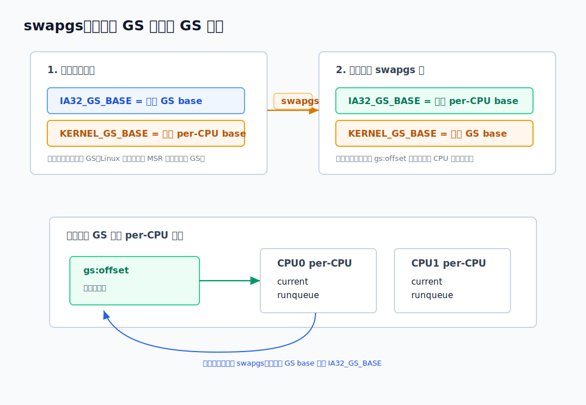
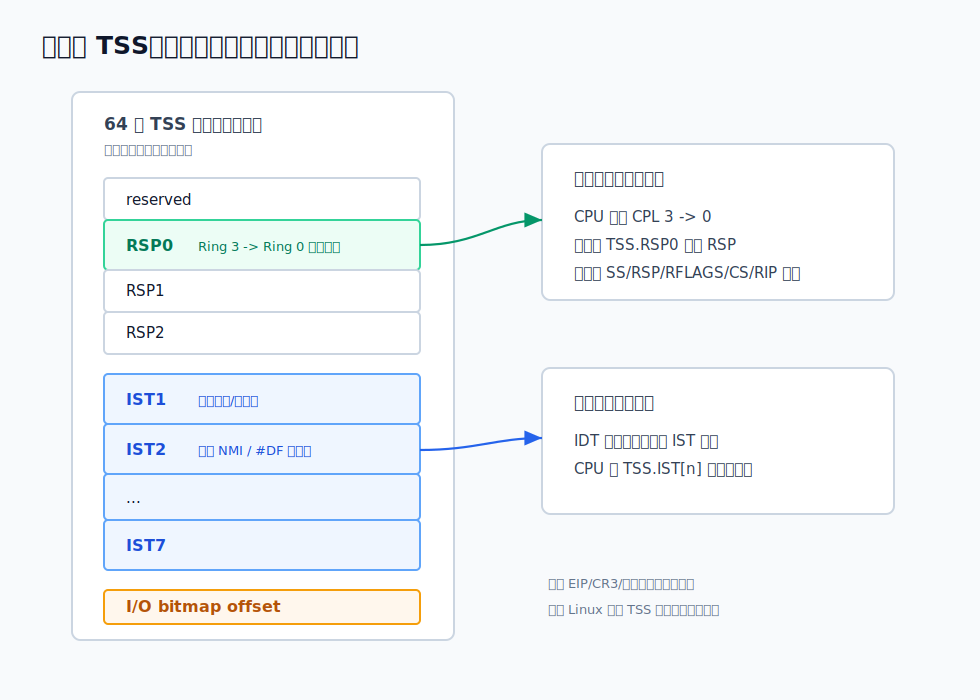

# 五、内核里的 GS / swapgs，与现代 TSS

---

> **系列说明**：这是"x86 的内存管理是怎么一步步演进来的"系列第五篇。整个系列想把三样东西从 **CPU 硬件的视角**讲透：**段寄存器机制**、**GDT / TSS 这些 CPU 层面的表和寄存器**、**页表的硬件翻译机制**。主线是一条演进史——从 1978 年的 8086，到 80386 的保护模式，再到今天的 x86-64。
>
> 六篇的安排是：[第一篇 8086 实模式的段寄存器（为什么会有"段"这东西）](<一、8086的段寄存器——16位寄存器怎么够到1MB内存.md>)；[第二篇 保护模式的段（选择子、GDT、段描述符的位结构）](<二、保护模式的段——选择子、GDT与64位段描述符.md>)；[第三篇 特权级与门，以及 TSS 当年的"本来用途"](<三、特权级与门，以及TSS的本来用途.md>)；[第四篇 x86-64 的简化（段基本废弃，FS/GS 为什么留下）](<四、x86-64的简化——段机制基本退场，FS和GS为什么留下.md>)；**第五篇（本文）** 内核里的 GS / swapgs 与现代 TSS；[第六篇 页表的 CPU 机制（CR3、page walk、PTE、KPTI）](<六、页表的CPU机制——CR3、page walk、PTE、TLB与KPTI.md>)。

---

上一篇讲到 x86-64 长模式做了一次大幅简化：普通的 CS/DS/ES/SS 不再用 base/limit 做地址划分，分段基本退到后台；但 FS/GS 的 base 被单独保留下来。用户态常用 FS base 指向 TLS，内核则常用 GS base 指向当前 CPU 的 per-CPU 数据区。

这一篇接着讲两个问题：

```
   1. 用户态进内核后，GS 怎么从"用户 GS"变成"内核 GS"？
   2. TSS 既然不再做硬件任务切换，为什么 x86-64 Linux 还离不开它？
```

答案分别是：

```
   swapgs：交换 IA32_GS_BASE 和 IA32_KERNEL_GS_BASE
   现代 TSS：主要留下 RSP0、IST 和 I/O bitmap
```

先说明本文实验环境。我的主机是 macOS ARM64，不能直接跑 x86-64 Linux 内核路径；下面涉及用户态可验证行为的结果，是在 Docker 的 `linux/amd64` Ubuntu 容器里实际跑出来的：

```text
$ uname -a
Linux cfb835b407ab 6.12.65-linuxkit #1 SMP Thu Jan 15 14:58:53 UTC 2026 x86_64 x86_64 x86_64 GNU/Linux
```

内核态的 TSS、MSR、入口汇编不能从普通用户态直接读写；那部分不会伪造"实验输出"，而是按 CPU 架构规则和 Linux 入口代码来讲。

## 一、内核为什么需要 GS：快速找到当前 CPU 的数据区

用户态有一个很高频的问题：怎么快速找到"当前线程"的 TLS。第四篇已经看到，x86-64 Linux 通常用 FS base 解决：

```
   用户态：
     FS.base -> 当前线程 TLS / TCB
```

内核也有一个类似但不完全一样的问题：怎么快速找到"当前 CPU"的私有数据。

这类数据叫 **per-CPU data**。它不是每个线程一份，而是每个 CPU 一份：

```
   CPU0:
     当前正在运行的 task 指针
     调度器运行队列
     中断/抢占计数
     每 CPU 统计数据

   CPU1:
     当前正在运行的 task 指针
     调度器运行队列
     中断/抢占计数
     每 CPU 统计数据
```

内核访问这些数据非常频繁。如果每次都先读 CPU 编号，再去全局数组里算偏移，成本太高，也不够顺手。更自然的方式是：让每个 CPU 都有一个自己的基址，内核代码用固定偏移访问。

GS 正好适合做这件事：

```asm
mov    rax, qword ptr gs:offset
```

同一条指令，在 CPU0 上用 CPU0 的 GS.base，在 CPU1 上用 CPU1 的 GS.base。指令不用知道自己跑在哪个 CPU 上；当前 CPU 由 GS.base 这个 CPU 状态决定。

所以 x86-64 Linux 的常见分工可以压成一句话：

```
   用户态 FS：当前线程指针
   内核态 GS：当前 CPU 指针
```

这和 ARM64 Linux 形成了一个很有意思的对照。ARM64 没有 x86 这种 FS/GS 段基址机制，Linux/arm64 在内核态常用 `sp_el0` 保存 `current` 指针。也就是说：

```
   x86-64 Linux：
     用 GS.base 找 per-CPU，再从 per-CPU 找 current

   ARM64 Linux：
     内核态直接把 current 放在 sp_el0 这种系统寄存器里
```

两边不是指令集形式相同，而是目标相同：**给内核一条很便宜的路径，拿到当前执行上下文。**

## 二、问题来了：用户态也有 GS，内核也想用 GS

FS/GS 在长模式下是特殊的，但它们仍然是 CPU 状态。用户态可以有自己的 GS base，内核也想把 GS base 用作 per-CPU 基址。

那从用户态进入内核时，CPU 该怎么办？

一种粗暴办法是：内核入口每次都用 `wrmsr` 把 IA32_GS_BASE 改成内核 per-CPU base，返回用户态前再改回去。但 `wrmsr` 是很重的特权指令，不适合放在每次系统调用、中断、异常入口上。

所以 x86-64 提供了一个专门指令：`swapgs`。

它只做一件事：

```
   交换：
     IA32_GS_BASE
     IA32_KERNEL_GS_BASE
```

可以把这两个 MSR 想成两个槽：

```
   IA32_GS_BASE          当前真正用于 gs:offset 的 GS base
   IA32_KERNEL_GS_BASE   备用槽，专门供 swapgs 对调
```

在用户态执行时，Linux 通常让它们长这样：

```
   IA32_GS_BASE          = 用户 GS base
   IA32_KERNEL_GS_BASE   = 内核 per-CPU base
```

进入内核后，入口代码执行一次：

```asm
swapgs
```

硬件对调两个 MSR：

```
   IA32_GS_BASE          = 内核 per-CPU base
   IA32_KERNEL_GS_BASE   = 用户 GS base
```

于是内核里的 `gs:offset` 就能访问 per-CPU 数据。返回用户态前再执行一次 `swapgs`，两个值换回来。



这就是 `swapgs` 的本质：它不是"进入内核"指令，也不是"切换任务"指令；它只是一个很窄的 GS base 对调指令。真正的入口控制流来自 `syscall`、中断门、异常门等机制。

## 三、用户态实际执行 swapgs 会怎样

`swapgs` 是特权指令，不能在 Ring 3 用户态随便执行。这里用一个小程序实测。

程序做三件事：

1. 用 `arch_prctl(ARCH_GET_FS/ARCH_GET_GS)` 读用户态可读的 FS/GS base。
2. 在用户态执行 `swapgs`。
3. 在用户态执行 `rdmsr` 读 `IA32_GS_BASE`。

完整代码如下：

```c
// gs_probe.c
#define _GNU_SOURCE

#include <asm/prctl.h>
#include <errno.h>
#include <signal.h>
#include <setjmp.h>
#include <stdio.h>
#include <string.h>
#include <sys/syscall.h>
#include <sys/utsname.h>
#include <unistd.h>

static sigjmp_buf env;
static volatile sig_atomic_t last_signal;

static void handler(int sig, siginfo_t *info, void *ctx)
{
    (void)info;
    (void)ctx;
    last_signal = sig;
    siglongjmp(env, 1);
}

static void install_handlers(void)
{
    struct sigaction sa;

    memset(&sa, 0, sizeof(sa));
    sa.sa_sigaction = handler;
    sa.sa_flags = SA_SIGINFO;

    sigaction(SIGILL, &sa, NULL);
    sigaction(SIGSEGV, &sa, NULL);
    sigaction(SIGBUS, &sa, NULL);
}

static void try_instruction(const char *name, void (*fn)(void))
{
    last_signal = 0;

    if (sigsetjmp(env, 1) == 0) {
        fn();
        printf("%-10s -> executed\n", name);
    } else {
        printf("%-10s -> signal %d (%s)\n",
               name, last_signal, strsignal(last_signal));
    }
}

static void do_swapgs(void)
{
    asm volatile(".byte 0x0f, 0x01, 0xf8" ::: "memory");
}

static void do_rdmsr_gs_base(void)
{
    unsigned int lo, hi;
    asm volatile("rdmsr" : "=a"(lo), "=d"(hi) : "c"(0xC0000101));
}

int main(void)
{
    struct utsname u;
    unsigned long fs = 0;
    unsigned long gs = 0;
    long ret_fs;
    long ret_gs;

    uname(&u);
    printf("uname      -> %s %s %s\n", u.sysname, u.release, u.machine);

    ret_fs = syscall(SYS_arch_prctl, ARCH_GET_FS, &fs);
    printf("ARCH_GET_FS -> ret=%ld errno=%d fs=0x%lx\n",
           ret_fs, ret_fs ? errno : 0, fs);

    ret_gs = syscall(SYS_arch_prctl, ARCH_GET_GS, &gs);
    printf("ARCH_GET_GS -> ret=%ld errno=%d gs=0x%lx\n",
           ret_gs, ret_gs ? errno : 0, gs);

    install_handlers();
    try_instruction("swapgs", do_swapgs);
    try_instruction("rdmsr", do_rdmsr_gs_base);

    return 0;
}
```

编译运行：

```bash
gcc -O2 -Wall gs_probe.c -o gs_probe
./gs_probe
```

反汇编确认生成的就是 `swapgs` 和 `rdmsr`：

```text
$ objdump -dr -Mintel /tmp/gs_probe | grep -A8 "<main>"
0000000000001040 <main>:
    1040:	f3 0f 1e fa          	endbr64
    1044:	0f 01 f8             	swapgs
    1047:	b9 01 01 00 c0       	mov    ecx,0xc0000101
    104c:	0f 32                	rdmsr
    104e:	31 c0                	xor    eax,eax
    1050:	c3                   	ret
```

完整探针实际输出如下：

```text
$ /tmp/gs_probe
uname      -> Linux 6.12.65-linuxkit x86_64
ARCH_GET_FS -> ret=0 errno=0 fs=0x7fffff5b0180
ARCH_GET_GS -> ret=0 errno=0 gs=0x0
swapgs     -> signal 11 (Segmentation fault)
rdmsr      -> signal 11 (Segmentation fault)
```

这几行说明两件事。

第一，用户态可以通过 Linux 提供的系统调用接口读 FS/GS base。这个容器里，当前线程 FS base 是一个非零地址，GS base 是 0。GS base 为 0 很常见，因为普通 x86-64 Linux 用户程序通常不用 GS。

第二，用户态直接执行 `swapgs` 或 `rdmsr` 都不行。CPU 在 CPL=3 执行这些特权指令时会抛异常，Linux 把异常递送成用户态信号；这次实测收到的是 `SIGSEGV`。

所以用户态不能直接窥探或切换内核 GS。真正的 `swapgs` 只能在内核入口/出口这类 Ring 0 路径上执行。

## 四、一次 syscall 入口里，swapgs 放在哪里

在 64 位 Linux 上，普通系统调用入口来自 `syscall` 指令。`syscall` 本身做的事比很多人想象得少：

```
   保存用户 RIP 到 RCX
   保存用户 RFLAGS 到 R11
   从 MSR 载入内核 CS/SS/RIP
   按 MSR 掩码清理一部分 RFLAGS

   但它不自动保存通用寄存器
   也不自动切换 RSP
```

注意最后一句：**`syscall` 不自动切换栈。**

这和中断门/异常门从用户态进内核不一样。中断/异常发生 CPL 3 -> 0 转换时，CPU 会从 TSS.RSP0 取内核栈；但 `syscall` 这条快速入口不走这套自动 TSS 换栈流程。

Linux 的 x86-64 syscall 入口大致是下面这样。这里先只盯住 `swapgs` 和换栈；如果想看从 `svc` / `syscall` 指令到内核汇编、`pt_regs`、再到 C 函数的完整入口链路，可以对照 syscall 系列第三篇《[内核入口 el0_svc / entry_SYSCALL_64 的汇编做了什么——从异常向量到 C 函数](../../CodeAdventure/syscall/三、内核入口el0_svc做了什么——从异常向量到C函数.md)》。

```asm
entry_SYSCALL_64:
    swapgs
    movq    %rsp, PER_CPU_VAR(cpu_tss_rw + TSS_sp2)
    SWITCH_TO_KERNEL_CR3
    movq    PER_CPU_VAR(cpu_current_top_of_stack), %rsp
    ...
```

流程含义是：

```
   1. syscall 让 CPU 跳到内核入口，但 RSP 仍是用户栈指针
   2. swapgs，把 GS 切成内核 per-CPU base
   3. 先把用户 RSP 暂存起来
   4. 软件加载当前任务的内核栈顶到 RSP
   5. 在内核栈上构造 pt_regs，进入 C 层系统调用分发
```

为什么 `swapgs` 必须很早？因为后面马上要用 `PER_CPU_VAR(...)` 访问 per-CPU 数据。`PER_CPU_VAR` 在 x86-64 上本质就是依赖 GS base 的固定偏移访问。GS 没换成内核 GS，内核就找不到自己的 per-CPU 区。

这里还有一个细节：上面的 `TSS_sp2` 并不是硬件任务切换的意思。Linux 在 64 位 syscall 入口里把 TSS 的 `sp2` 当成一个方便的 per-CPU scratch slot，用来临时保存用户 RSP。长模式硬件不会在 syscall 入口自动使用 `RSP2`。

把 syscall 入口画成步骤就是：

```
   用户态
     │
     │ syscall
     ▼
   CPU 从 MSR 装载内核入口 RIP
     │        （不换 RSP）
     ▼
   entry_SYSCALL_64
     │
     ├─ swapgs
     │     GS.base = 内核 per-CPU base
     │
     ├─ 保存用户 RSP
     │
     ├─ 软件切到内核栈
     │
     └─ 调 do_syscall_64
```

这也是第五篇和第六篇的连接点：如果开启 KPTI，入口路径还会切 CR3，把用户页表切到内核页表。`swapgs` 解决的是"GS base 指向哪块 per-CPU 数据"；CR3 解决的是"当前虚拟地址空间用哪套页表"。两者是两套机制。

## 五、中断/异常从用户态进内核：TSS.RSP0 登场

现在看另一条入口：中断或异常。

如果中断/异常发生在用户态，并且目标门进入 Ring 0，CPU 会发现这次控制流要从 CPL=3 进入 CPL=0。这个时候，硬件会自动换栈。

换到哪里？看当前 CPU 的 TSS。

长模式 TSS 里有三个特权级栈指针：

```
   RSP0
   RSP1
   RSP2
```

现代 Linux 基本只用 Ring 0 和 Ring 3，所以关键是 `RSP0`。当 CPU 从用户态进入内核态时：

```
   新 RSP = TSS.RSP0
```

然后 CPU 在这个新栈上压入返回现场，典型内容包括：

```
   旧 SS
   旧 RSP
   RFLAGS
   旧 CS
   旧 RIP
   可能还有 error code
```

这一步是硬件自动完成的。最简单的理解是：

```
   TSS.RSP0 里放着一个内核栈顶地址。
   用户态发生中断/异常后，CPU 第一脚就落到这个栈上。
```

但 Linux 的具体实现可以更绕一点。`TSS.RSP0` 不一定永远直接指向"当前任务最终要使用的那条内核栈"；在一些配置和入口路径上，它可以先指向一段 **入口栈**，也就是每 CPU 准备的一小段中转栈。CPU 先按硬件规则切到这段入口栈，入口汇编站稳以后，再由软件切到当前任务自己的内核栈。

可以画成两层：

```
   CPU 硬件只知道这一层：

     用户栈
       │  中断/异常，CPL 3 -> 0
       ▼
     TSS.RSP0 指向的栈


   Linux 入口代码可能再做一层：

     TSS.RSP0 指向的入口栈
       │  入口汇编检查状态、切 GS/CR3、准备 pt_regs
       ▼
     当前任务的内核栈
```

所以这句话不是说 TSS 有了新机制，也不是说 CPU 会自动认识"trampoline stack"。CPU 只认识 `TSS.RSP0`。入口栈 / trampoline stack 是 Linux 把 `RSP0` 指向哪里、以及入口汇编接下来怎么搬家的实现选择。

也就是说，中断/异常入口和 syscall 入口的关键区别是：

```
   中断/异常门：
     CPL 3 -> 0 时，CPU 自动从 TSS.RSP0 换栈

   syscall：
     CPU 不自动换 RSP，Linux 入口代码自己切到内核栈
```

这就是为什么 TSS 在 x86-64 里还活着。它不再保存"一个任务的整套寄存器"，但 CPU 仍然要从它那里拿到一些入口栈信息。

## 六、现代 TSS 长什么样

第三篇讲过，80386 时代的 TSS 很大，里面可以放 EIP、EFLAGS、CR3、通用寄存器、段寄存器等一整套任务状态。CPU 可以通过任务门或 TSS 描述符做硬件任务切换。

x86-64 长模式把这条路基本废掉了。现代 TSS 的核心字段变成：

```
   RSP0
   RSP1
   RSP2
   IST1 ... IST7
   I/O permission bitmap offset
```



逐个看。

`RSP0/RSP1/RSP2` 是特权级栈指针。现代系统几乎只关心 `RSP0`：

```
   从 Ring 3 进入 Ring 0 的中断/异常：
     CPU 用 TSS.RSP0 作为新内核栈
```

`IST` 是 **Interrupt Stack Table**，一共有 7 项。第三篇《[特权级与门，以及 TSS 的本来用途](三、特权级与门，以及TSS的本来用途.md#中断门和陷阱门idt-里的受控入口)》在"中断门和陷阱门：IDT 里的受控入口"这一节里已经拆过 IDT 门描述符的静态结构：长模式 IDT gate 里有一个 IST 字段，可以指定一个 IST 编号。

如果某个异常门指定了 IST，CPU 进入这个异常时会直接切到对应的 IST 栈，而不是普通的 RSP0 路径。

这主要给特别危险的异常用。例如：

```
   NMI：不可屏蔽中断，可能打断几乎任何位置
   #DF：双重故障，普通栈可能已经坏了
   #MC：机器检查，状态可能很脆弱
```

这些路径需要一块更独立的栈，避免"异常发生时当前栈已经不可用"导致处理器继续崩。

`I/O permission bitmap` 用来控制低特权级代码能不能执行端口 I/O 指令。这里要先解释一下 x86 的 **端口 I/O**。

x86 除了普通内存地址空间，还有一套独立的 I/O port 地址空间。CPU 访问内存用 `mov/load/store` 这类指令；访问 I/O 端口用专门的 `in/out` 指令：

```asm
in   al, dx      ; 从 dx 指定的 I/O 端口读 1 字节到 al
out  dx, al      ; 把 al 写到 dx 指定的 I/O 端口
```

这里的 `dx` 不是内存地址，而是一个端口号。早期 PC 上，很多硬件控制寄存器就是通过端口 I/O 暴露出来的。比如键盘控制器、串口、PIC、PIT、部分 legacy 设备，都可能有自己的端口号。也就是说，`out dx, al` 不是在写某个普通变量，而可能是在直接改硬件设备状态。

所以 CPU 必须限制低特权级代码随便执行这些指令。否则用户程序如果能任意 `out`，就可以直接操作硬件，绕过内核驱动和权限模型。

x86 对端口 I/O 的权限判断分两层。

第一层是 **IOPL（I/O Privilege Level）**。它在 `RFLAGS/EFLAGS` 里，是一个 0 到 3 的特权级数字；如果你对 `RFLAGS/EFLAGS` 不熟，可以先看文末附录。

```
   如果 CPL <= IOPL：
     当前代码可以执行端口 I/O

   如果 CPL > IOPL：
     当前代码权限不够，继续查 TSS 里的 I/O permission bitmap
```

注意方向还是 x86 那套规则：数字越小权限越高。内核 CPL=0，通常天然满足 `CPL <= IOPL`；用户态 CPL=3，一般不满足，因为现代内核通常不会让普通进程拥有高 I/O 权限。

第二层才是 **TSS 里的 I/O permission bitmap**。TSS 里不是直接塞整张位图，而是放一个 offset：

```
   TSS
   ┌──────────────────────────┐
   │ RSP0 / RSP1 / RSP2       │
   │ IST1 ... IST7            │
   │ ...                      │
   │ I/O bitmap base offset   │──┐
   └──────────────────────────┘  │
                                 ▼
                         I/O permission bitmap
```

这张 bitmap 的粒度是 **一个端口一位**：

```
   bit = 0：允许访问这个 I/O port
   bit = 1：禁止访问这个 I/O port
```

端口号怎么对应到位？可以粗略理解成：

```
   port N 对应 bitmap 里的第 N 位
```

例如：

```
   端口 0x3f8  ->  bitmap 第 0x3f8 位
   端口 0x60   ->  bitmap 第 0x60 位
```

这里的"一个端口一位"要和操作数宽度配起来看；更准确地说，I/O permission bitmap 的每一 bit 对应一个 I/O port byte address。若当前权限条件需要查 I/O bitmap，则 `in al, dx` / `out dx, al` 是 8 位 I/O，只检查 `port N`；`in ax, dx` / `out dx, ax` 是 16 位 I/O，会检查 `port N` 和 `port N+1`；`in eax, dx` / `out dx, eax` 是 32 位 I/O，会检查 `port N` 到 `port N+3`。这里没有漏掉 64 位寄存器：`IN/OUT` 指令没有 `in rax, dx` 或 `out dx, rax` 这种 64 位端口 I/O 形式，long mode 下标量端口 I/O 也只有 8/16/32 位宽度。

所以一次用户态端口 I/O 的硬件判定可以画成这样：

```
   用户态执行 in/out
          │
          ▼
   当前 CPL <= IOPL ?
          │
     ┌────┴────┐
     │是       │否
     ▼         ▼
   允许     查当前 TSS 的 I/O bitmap
               │
               ▼
        目标端口范围对应 bit 是否全为 0？
               │
          ┌────┴────┐
          │是       │否
          ▼         ▼
        允许       #GP
```

这解释了为什么 I/O bitmap 还放在 TSS 里：它是 CPU 做端口 I/O 权限检查时要读的架构状态。虽然现代 TSS 不再保存整套任务寄存器，不再做硬件任务切换，但它仍然保存了 CPU 入口和权限检查需要的少数字段。

在 Linux 上，普通用户程序默认不能直接执行端口 I/O。少数程序如果确实需要直接访问某些 legacy 端口，通常要通过内核接口申请权限，例如 `ioperm()` 给一段端口范围开权限，或者更粗的 `iopl()` 调整 I/O 特权级；这些操作需要足够的权限，常见要求是 `CAP_SYS_RAWIO`。内核最终要么调整任务的 I/O bitmap，要么调整相关 I/O 权限状态。普通应用不该绕过驱动直接碰硬件端口。

反过来，长模式 TSS **不再**承担这些职责：

```
   不保存当前任务的 RIP
   不保存当前任务的 CR3
   不保存通用寄存器
   不靠硬件任务门切换 Linux 进程
```

Linux 做上下文切换时，仍然是软件保存/恢复寄存器、切内核栈、必要时切 CR3。第三篇里那个"硬件任务切换"的宏大设计，在现代 64 位 Linux 里不是主线。

## 七、TR 和每 CPU TSS：CPU 怎么找到这张表

TSS 仍然是一个由 CPU 认识的系统结构，所以它仍然要通过 GDT 描述符登记。

第二篇讲过普通代码段/数据段描述符是 8 字节；在 x86-64 里，TSS 描述符是系统描述符，而且是 16 字节，因为它要保存 64 位 TSS base。

静态结构可以画成这样：

```
   x86-64 TSS 描述符，16 字节

   高 8 字节：

    127                            96 95                         64
   ┌────────────────────────────────┬─────────────────────────────┐
   │ Reserved                       │ Base 63:32                 │
   └────────────────────────────────┴─────────────────────────────┘

   低 8 字节：

    63             56 55 52 51 48 47  46 45  44 43      40 39             32
   ┌────────────────┬─────┬─────┬────┬────┬────┬─────────┬────────────────┐
   │ Base 31:24     │Flags│Limit│ P  │ DPL│ S=0│ Type    │ Base 23:16     │
   └────────────────┴─────┴─────┴────┴────┴────┴─────────┴────────────────┘
    31             16 15                                                   0
   ┌────────────────┬──────────────────────────────────────────────────────┐
   │ Base 15:0      │ Limit 15:0                                           │
   └────────────────┴──────────────────────────────────────────────────────┘
```

字段含义是：

```
   Base：
     TSS 结构体在内存里的线性地址。
     由 Base[15:0]、Base[23:16]、Base[31:24]、Base[63:32] 拼成 64 位。

   Limit：
     TSS 的大小边界。CPU 用它确认访问 TSS 字段时没有越过描述符声明的范围。

   Type：
     0x9 = available 64-bit TSS
     0xB = busy 64-bit TSS

   S：
     系统描述符固定为 0。TSS 描述符不是普通代码段/数据段。

   DPL：
     这个 TSS 描述符可被哪些特权级的软件路径访问。
     普通内核用 ltr 加载自己的 TSS，通常是 Ring 0 路径。

   P：
     Present。P=0 时，这个 TSS 描述符不可用。

   Flags：
     对 TSS 描述符来说大多不像普通段描述符那样有实际意义。
```

为什么 TSS 描述符要扩成 16 字节？关键就是 `Base[63:32]`。普通 8 字节段描述符只能容纳 32 位 base；但长模式下 TSS 结构体可能位于 64 位线性地址空间，所以系统描述符要多占一个 8 字节槽，把高 32 位 base 放进去。

`Type` 里的 available / busy 也和第三篇讲的硬件任务切换历史有关。CPU 执行 `ltr` 加载 TSS 后，会把对应 TSS 描述符标成 busy。现代 Linux 不靠硬件任务切换来回切 TSS，但这个架构状态仍然存在。

启动 CPU 时，内核会准备每个 CPU 自己的 TSS，然后执行 `ltr` 加载任务寄存器 TR：

```
   TR.selector -> GDT 里的 TSS 描述符
                    │
                    ├── TSS base
                    └── TSS limit / type / P
```

和段寄存器类似，TR 也有可见的 selector 和 CPU 内部缓存的描述符信息。`ltr` 之后，CPU 就知道"当前 CPU 的 TSS 在哪里"。

为什么是每 CPU 一份 TSS，而不是每进程一份？

因为现代 TSS 的用途已经变了。它主要服务于 CPU 入口路径：

```
   当前 CPU 的 RSP0
   当前 CPU 的 IST 栈
   当前 CPU 的 I/O bitmap 状态
```

这些天然是 per-CPU 的。进程切换时，Linux 不会让 CPU 硬件切到另一个 TSS；它只会更新当前 CPU 的 TSS.RSP0，让下一次从用户态发生中断/异常时，硬件能落到正确的内核栈。

可以这么理解：

```
   80386 设想：
     一个任务一个 TSS，任务切换时 CPU 切 TSS

   现代 x86-64 Linux：
     一个 CPU 一个主要 TSS，任务切换时软件更新其中少数字段
```

## 八、把 interrupt 和 syscall 放到一张对照表里

现在把两条入口路径并排看：

```
   用户态 -> 内核态：中断/异常门

     1. CPU 查 IDT 门描述符
     2. 发现目标 CPL=0，当前 CPL=3
     3. CPU 从当前 TSS.RSP0 取新 RSP
     4. CPU 在新内核栈上压旧 SS/RSP/RFLAGS/CS/RIP
     5. 进入内核异常/中断入口
     6. 内核入口根据路径处理 GS、CR3、pt_regs 等状态
```

```
   用户态 -> 内核态：syscall

     1. CPU 从 MSR 取内核 CS/SS/RIP
     2. CPU 保存用户 RIP 到 RCX，保存 RFLAGS 到 R11
     3. CPU 不自动换 RSP
     4. Linux 入口执行 swapgs
     5. Linux 软件保存用户 RSP，切到内核栈
     6. 进入 do_syscall_64
```

它们都从 Ring 3 进入 Ring 0，但硬件自动做的事情不一样。

这也是很多 x86-64 入口代码看起来复杂的原因：不是所有"进内核"都走同一条硬件路径。中断门、异常门、`syscall`、`sysenter`、虚拟化、KPTI、IST、NMI，都有各自的入口约束。`swapgs` 和 TSS 是其中两块关键拼图。

## 九、swapgs 进出必须配对，但不是所有内核入口都能盲目 swapgs

`swapgs` 的危险在于它没有"当前状态检查"。它只是交换两个 MSR。

如果当前已经是内核 GS，再执行一次 `swapgs`，就会把用户 GS 换回来。此时内核再执行 `gs:offset`，就可能拿用户 GS base 当 per-CPU base，用错地址。

所以入口代码必须知道自己当前面对的是哪种情况：

```
   从用户态进入：
     需要 swapgs，切到内核 GS

   从内核态发生异常/中断：
     不能盲目 swapgs，因为本来就在内核 GS

   返回用户态：
     需要 swapgs，恢复用户 GS

   返回内核态：
     不需要恢复用户 GS
```

这就是为什么 Linux 入口汇编里会有很多判断：看中断栈上保存的 CS 低两位，判断来源是不是用户态；NMI、machine check、double fault 这类路径还要更谨慎，因为它们可能打断内核执行，也可能打断用户执行。

`swapgs` 很小，但放错位置就是入口级 bug。现代 CPU 还出现过和 `swapgs` 推测执行相关的安全问题，内核入口周围因此有额外的屏障和缓解逻辑。这里先不展开；主线只需要记住：

```
   swapgs 是一个无条件对调指令。
   正确性来自内核入口代码对"当前来自用户态还是内核态"的判断。
```

## 十、收束：段机制留下的两个影子

到这里，段机制的现代形态已经很清楚了。

第一篇里，段寄存器是 8086 为了够到 1MB 地址空间做的补丁：

```
   物理地址 = 段 << 4 + 偏移
```

第二、三篇里，保护模式把段扩展成选择子、GDT/LDT、描述符、权限、门、TSS、硬件任务切换。

第四篇里，x86-64 长模式基本废掉普通分段，只留下 FS/GS base 作为特殊基址。

本文看到，到了现代 Linux 内核，段机制留下两个很实用的影子：

```
   GS base：
     不再拿来分割地址空间，而是作为当前 CPU 的快速基址。

   TSS：
     不再拿来硬件任务切换，而是给 CPU 入口路径提供 RSP0、IST、I/O bitmap。
```

所以第五篇的结论可以写得很短：

```
   x86-64 没有把旧机制完全删掉。
   它把旧机制压缩成少数入口路径需要的 CPU 状态。

   GS 负责快速定位 per-CPU。
   swapgs 负责用户 GS / 内核 GS 对调。
   TSS 负责特权级入口换栈和特殊异常栈。
```

下一篇就进入第三条主线：分页。长模式下普通段基本透明以后，真正决定虚拟地址怎么变成物理地址的，是 CR3、四级页表、PTE、TLB，以及 KPTI 这类现代内核隔离设计。

## 附录：RFLAGS 是什么

`RFLAGS` 是 x86-64 里的 **标志寄存器**。它不像 `RAX/RBX` 那样主要拿来放普通整数，而是保存一组 CPU 状态位和控制位。

先看名字关系：

```
   FLAGS   ：16 位时代的标志寄存器
   EFLAGS  ：32 位扩展后的标志寄存器
   RFLAGS  ：x86-64 长模式下的 64 位标志寄存器
```

它们不是三套完全不同的东西，而是一套寄存器随架构位宽扩展出来的名字。本文讨论的是 x86-64，所以后面直接说 `RFLAGS`。它是 64 位寄存器，但低 32 位基本继承 `EFLAGS`，高 32 位目前大多是保留位。

这类标志大致分三类：

```
   状态标志：
     算术/逻辑指令执行后留下的结果状态，比如是否为 0、是否进位、是否溢出。

   控制标志：
     控制 CPU 某些行为，比如方向标志 DF、中断允许标志 IF。

   系统标志：
     和特权级、虚拟化、调试、I/O 权限相关，比如 IOPL、NT、RF、VM。
```

直接把 64 位 `RFLAGS` 画出来：

```
   RFLAGS，64 bit

    63                                                    32 31        22
   ┌────────────────────────────────────────────────────────┬────────────┐
   │ reserved                                               │ reserved   │
   └────────────────────────────────────────────────────────┴────────────┘

    21 20 19 18 17 16 15 14 13 12 11 10  9  8  7  6  5  4  3  2  1  0
   ┌──┬──┬──┬──┬──┬──┬──┬─────┬──┬──┬──┬──┬──┬──┬──┬──┬──┬──┬──┬──┐
   │ID│VIP│VIF│AC│VM│RF│NT│IOPL │OF│DF│IF│TF│SF│ZF│  │AF│  │PF│  │CF│
   └──┴──┴──┴──┴──┴──┴──┴─────┴──┴──┴──┴──┴──┴──┴──┴──┴──┴──┴──┴──┘

   bit 1 固定为 1；图里留空的 bit 3、5、15 是保留位。
```

几个和本文关系近的字段：

```
   IF，bit 9：
     Interrupt Flag。控制可屏蔽外部中断是否允许递送。
     中断门和陷阱门的区别之一，就是中断门进入处理程序时会清 IF，
     陷阱门不会清 IF。

   IOPL，bit 12-13：
     I/O Privilege Level。端口 I/O 的粗粒度权限门槛。
     执行 in/out 这类 I/O 指令时，CPU 会拿 CPL 和 IOPL 比较。

   DF，bit 10：
     Direction Flag。影响字符串指令处理方向，比如 movs/stos 是地址递增还是递减。

   TF，bit 8：
     Trap Flag。单步调试用，置位后每执行一条指令可触发调试异常。

   ZF/SF/CF/OF/PF/AF：
     算术/逻辑结果标志。比如 cmp/test 之后，条件跳转 jz/jnz/jc/jo 等会看这些位。
```

本文前面说 `syscall` 会把用户 `RFLAGS` 保存到 `R11`，意思就是：CPU 进入内核时不能把用户态这些状态位丢掉。等 `sysret` 返回用户态时，还要根据约定恢复必要的标志状态。

`IOPL` 放在 `RFLAGS/EFLAGS` 里也正是这个原因：它是当前执行上下文的一部分，CPU 执行 `in/out` 时会直接读取它。若当前特权级已经满足：

```
   CPL <= IOPL
```

端口 I/O 直接允许；否则才继续查 TSS 里的 I/O permission bitmap，做更细的端口级判断。

---

上一篇：[x86-64 的简化——段机制基本退场，FS 和 GS 为什么留下](<四、x86-64的简化——段机制基本退场，FS和GS为什么留下.md>)

下一篇：[页表的 CPU 机制——CR3、page walk、PTE、TLB 与 KPTI](<六、页表的CPU机制——CR3、page walk、PTE、TLB与KPTI.md>)
