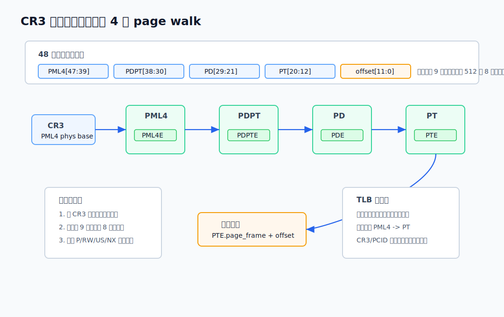
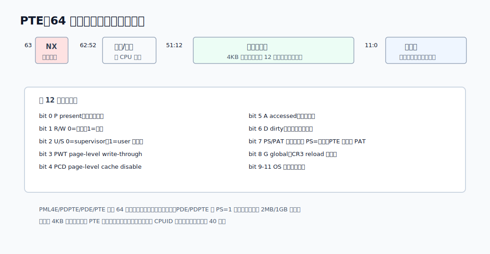
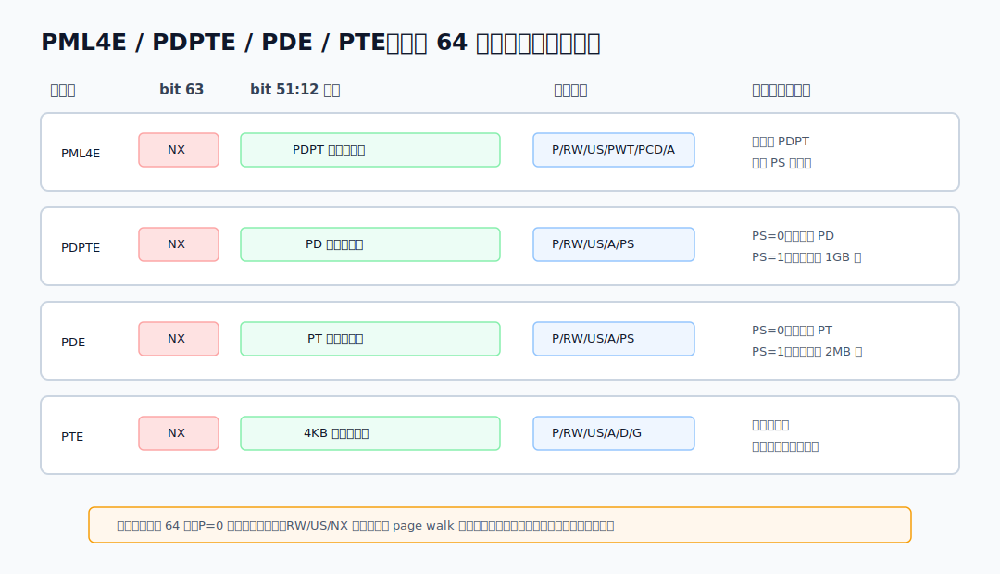
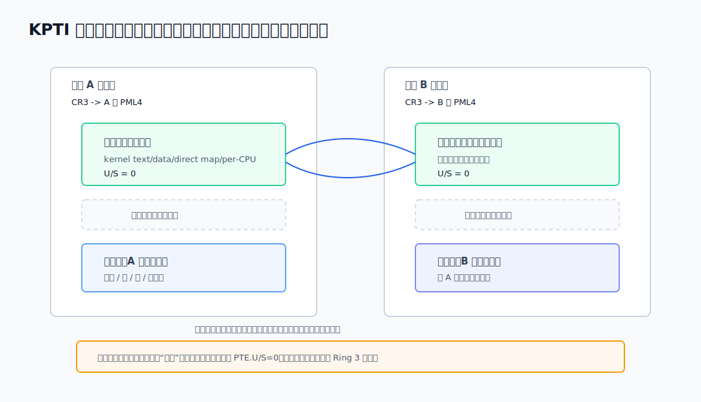
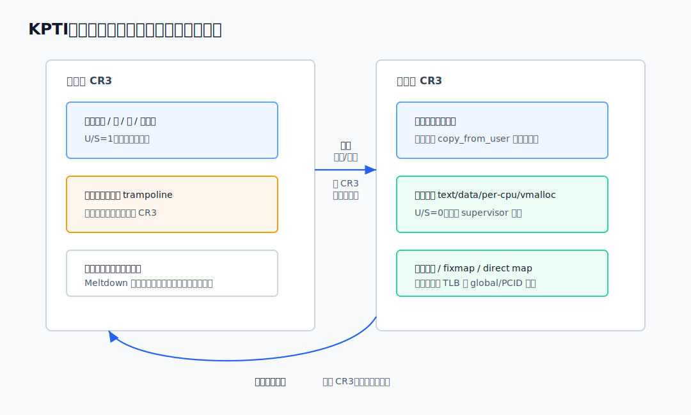

# 六、页表的 CPU 机制：CR3、page walk、PTE、TLB 与 KPTI

---

> **系列说明**：这是"x86 的内存管理是怎么一步步演进来的"系列第六篇。整个系列想把三样东西从 **CPU 硬件的视角**讲透：**段寄存器机制**、**GDT / TSS 这些 CPU 层面的表和寄存器**、**页表的硬件翻译机制**。主线是一条演进史——从 1978 年的 8086，到 80386 的保护模式，再到今天的 x86-64。
>
> 六篇的安排是：第一篇 8086 实模式的段寄存器（为什么会有"段"这东西）；第二篇 保护模式的段（选择子、GDT、段描述符的位结构）；第三篇 特权级与门，以及 TSS 当年的"本来用途"；第四篇 x86-64 的简化（段基本废弃，FS/GS 为什么留下）；第五篇 内核里的 GS / swapgs 与现代 TSS；**第六篇（本文）** 页表的 CPU 机制（CR3、page walk、PTE、TLB、KPTI）。

---

前五篇把"段"这条线收完了：8086 的段一开始是为了凑 20 位物理地址；保护模式把段升级成选择子、GDT、描述符和权限检查；到了 x86-64 长模式，普通段的 base/limit 基本退场，只留下 FS/GS 在 TLS、per-CPU、`swapgs` 这些地方继续发光。

但现代 x86-64 真正承担地址隔离的主角，不是段，而是**页表**。

这篇从 CPU 的视角讲页表。不是"操作系统为什么用多级页表省内存"那条线，而是回答这些更贴近硬件的问题：

```
   1. CPU 从哪里找到当前进程的页表？
   2. 一条虚拟地址怎么被硬件拆开，一级级走到物理地址？
   3. 64 位 PTE 里每一位大概在管什么？
   4. TLB 为什么能把 page walk 的成本压下去？
   5. KPTI 为什么要让进出内核时切 CR3？
```

先说明实验环境。我的主机是 macOS ARM64，不能直接跑原生 x86-64 Linux；下面用户态能验证的结果，是在 Docker 的 `linux/amd64` Debian/GCC 容器里实际跑出来的。

完整代码如下：

```c
#define _GNU_SOURCE

#include <cpuid.h>
#include <errno.h>
#include <signal.h>
#include <setjmp.h>
#include <stdint.h>
#include <stdio.h>
#include <stdlib.h>
#include <string.h>
#include <sys/mman.h>
#include <sys/syscall.h>
#include <sys/utsname.h>
#include <time.h>
#include <unistd.h>

static sigjmp_buf env;
static volatile sig_atomic_t last_signal;

static void handler(int sig, siginfo_t *info, void *ctx)
{
    (void)info;
    (void)ctx;
    last_signal = sig;
    siglongjmp(env, 1);
}

static void install_handlers(void)
{
    struct sigaction sa;
    memset(&sa, 0, sizeof(sa));
    sa.sa_sigaction = handler;
    sa.sa_flags = SA_SIGINFO;
    sigaction(SIGILL, &sa, NULL);
    sigaction(SIGSEGV, &sa, NULL);
    sigaction(SIGBUS, &sa, NULL);
}

static void try_instruction(const char *name, void (*fn)(void))
{
    last_signal = 0;
    if (sigsetjmp(env, 1) == 0) {
        fn();
        printf("%-12s -> executed\n", name);
    } else {
        printf("%-12s -> signal %d (%s)\n",
               name, last_signal, strsignal(last_signal));
    }
}

static void do_mov_cr3(void)
{
    uintptr_t cr3;
    asm volatile("mov %%cr3, %0" : "=r"(cr3));
}

static void do_invlpg(void)
{
    int x = 0;
    asm volatile("invlpg (%0)" :: "r"(&x) : "memory");
}

static long read_vmpte_kb(void)
{
    FILE *f = fopen("/proc/self/status", "r");
    char line[256];
    long kb = -1;

    if (!f)
        return -1;

    while (fgets(line, sizeof(line), f)) {
        if (sscanf(line, "VmPTE: %ld kB", &kb) == 1)
            break;
    }
    fclose(f);
    return kb;
}

static void show_status(const char *tag)
{
    FILE *f = fopen("/proc/self/status", "r");
    char line[256];

    printf("--- %s ---\n", tag);
    if (!f) {
        printf("open /proc/self/status failed: %s\n", strerror(errno));
        return;
    }

    while (fgets(line, sizeof(line), f)) {
        if (!strncmp(line, "VmSize:", 7) ||
            !strncmp(line, "VmRSS:", 6) ||
            !strncmp(line, "VmPTE:", 6))
            fputs(line, stdout);
    }
    fclose(f);
}

static void cpuid_summary(void)
{
    unsigned int eax, ebx, ecx, edx;
    char vendor[13];

    __cpuid(0, eax, ebx, ecx, edx);
    memcpy(vendor + 0, &ebx, 4);
    memcpy(vendor + 4, &edx, 4);
    memcpy(vendor + 8, &ecx, 4);
    vendor[12] = 0;

    __cpuid(0x80000008u, eax, ebx, ecx, edx);
    printf("cpuid vendor       -> %s\n", vendor);
    printf("physical addr bits -> %u\n", eax & 0xff);
    printf("linear addr bits   -> %u\n", (eax >> 8) & 0xff);

    __cpuid(1, eax, ebx, ecx, edx);
    printf("pcid support       -> %s\n", (ecx & (1u << 17)) ? "yes" : "no");

    __cpuid_count(7, 0, eax, ebx, ecx, edx);
    printf("la57 support       -> %s\n", (ecx & (1u << 16)) ? "yes" : "no");
}

static void page_table_growth(void)
{
    const size_t n = 256UL << 20;
    long page = sysconf(_SC_PAGESIZE);
    char *p;

    show_status("start");

    p = mmap(NULL, n, PROT_READ | PROT_WRITE,
             MAP_PRIVATE | MAP_ANONYMOUS, -1, 0);
    if (p == MAP_FAILED) {
        printf("mmap failed: %s\n", strerror(errno));
        return;
    }

    show_status("after mmap 256MB, before touch");

    for (size_t i = 0; i < n; i += (size_t)page)
        p[i] = 1;

    show_status("after touching every page");
    // 解除这段映射；内核会回收对应的物理页和为它长出来的页表页。
    munmap(p, n);
}

static uint64_t nsec(void)
{
    struct timespec ts;
    clock_gettime(CLOCK_MONOTONIC, &ts);
    return (uint64_t)ts.tv_sec * 1000000000ull + (uint64_t)ts.tv_nsec;
}

static void tlb_probe(void)
{
    const long page = sysconf(_SC_PAGESIZE);
    const size_t total_pages = 8192;
    const size_t rounds = 20000000;
    volatile unsigned char *buf;

    buf = mmap(NULL, total_pages * (size_t)page, PROT_READ | PROT_WRITE,
               MAP_PRIVATE | MAP_ANONYMOUS, -1, 0);
    if (buf == MAP_FAILED) {
        printf("tlb mmap failed: %s\n", strerror(errno));
        return;
    }

    for (size_t i = 0; i < total_pages; i++)
        buf[i * (size_t)page] = (unsigned char)i;

    printf("tlb stride test    -> one byte per 4KB page, %zu loads\n", rounds);
    for (size_t pages = 16; pages <= total_pages; pages *= 4) {
        uint64_t start, end;
        unsigned int sink = 0;

        start = nsec();
        for (size_t i = 0; i < rounds; i++) {
            size_t page_index = (i * 1315423911u) & (pages - 1);
            sink += buf[page_index * (size_t)page];
        }
        end = nsec();

        printf("%5zu pages (%5zu KB) -> %8.3f ns/load  sink=%u\n",
               pages, pages * (size_t)page / 1024,
               (double)(end - start) / (double)rounds, sink);
    }

    munmap((void *)buf, total_pages * (size_t)page);
}

int main(void)
{
    struct utsname u;
    FILE *f;
    char line[256];

    uname(&u);
    printf("uname              -> %s %s %s\n", u.sysname, u.release, u.machine);
    printf("page size          -> %ld\n", sysconf(_SC_PAGESIZE));
    cpuid_summary();

    f = fopen("/sys/devices/system/cpu/vulnerabilities/meltdown", "r");
    if (f) {
        if (fgets(line, sizeof(line), f))
            printf("meltdown status    -> %s", line);
        fclose(f);
    }

    install_handlers();
    try_instruction("mov-cr3", do_mov_cr3);
    try_instruction("invlpg", do_invlpg);

    page_table_growth();
    printf("VmPTE after unmap   -> %ld kB\n", read_vmpte_kb());

    tlb_probe();
    return 0;
}
```

复现时，把上面的完整代码保存为 `/tmp/page_mechanism_probe.c`，然后执行下面的命令。命令会把这个源码文件挂到容器里的 `/tmp/page_mechanism_probe.c`。

运行命令和结果如下：

```text
$ docker run --rm --platform linux/amd64 \
    -v /tmp/page_mechanism_probe.c:/tmp/page_mechanism_probe.c:ro gcc:13 \
    bash -lc 'gcc -O2 -Wall -Wextra /tmp/page_mechanism_probe.c -o /tmp/page_mechanism_probe && /tmp/page_mechanism_probe'

uname              -> Linux 6.12.65-linuxkit x86_64
page size          -> 4096
cpuid vendor       -> GenuineIntel
physical addr bits -> 40
linear addr bits   -> 48
pcid support       -> no
la57 support       -> no
meltdown status    -> Not affected
mov-cr3      -> signal 4 (Illegal instruction)
invlpg       -> signal 11 (Segmentation fault)
--- start ---
VmSize:	  287432 kB
VmRSS:	    4528 kB
VmPTE:	     100 kB
--- after mmap 256MB, before touch ---
VmSize:	  549580 kB
VmRSS:	    4532 kB
VmPTE:	     100 kB
--- after touching every page ---
VmSize:	  549580 kB
VmRSS:	  266676 kB
VmPTE:	     612 kB
VmPTE after unmap   -> 100 kB
tlb stride test    -> one byte per 4KB page, 20000000 loads
   16 pages (   64 KB) ->    0.426 ns/load  sink=150000000
   64 pages (  256 KB) ->    1.443 ns/load  sink=630000000
  256 pages ( 1024 KB) ->    1.812 ns/load  sink=2550000000
 1024 pages ( 4096 KB) ->    1.421 ns/load  sink=2550000000
 4096 pages (16384 KB) ->    1.970 ns/load  sink=2550000000
```

这份输出里有两点要提前说清楚：

- `mov %cr3`、`invlpg` 这类指令是特权操作，普通用户态不能真正执行。所以我们能实测的是：用户态执行它们会被 CPU/内核拦下；不能在 Ring 3 直接打印真实 CR3。
- 这个 Docker 环境报告 `pcid support -> no`、`meltdown status -> Not affected`，所以本文里 PCID、KPTI 的部分讲机制，不伪造一份"本机开启 KPTI"的输出。

## 一、CR3：CPU 从这里找到当前页表

在 x86-64 里，段机制之后得到的是**线性地址**。如果分页开启，CPU 还要把线性地址翻译成物理地址，才能真正访问内存。

翻译的入口在一个控制寄存器里：**CR3**。

最核心的一句话是：

```
   CR3 保存当前地址空间的顶级页表物理地址。
```

在常见的 4 级分页里，顶级页表叫 **PML4**。所以可以把 CR3 看成：

```
   CR3 -> 当前进程的 PML4 表
```

注意这里是**物理地址**，不是虚拟地址。原因很直接：页表本身就是拿来做虚拟到物理翻译的，如果 CR3 里再放虚拟地址，CPU 第一脚就踩进循环依赖了。

在没有 PCID 的简化模型下，CR3 的高位存 PML4 的物理页框地址，低 12 位不用来存地址，因为页表页 4KB 对齐：

```
   CR3：

   63                                      12 11      0
   ┌────────────────────────────────────────┬─────────┐
   │       PML4 物理页基址 / 页框号          │  低位标志 │
   └────────────────────────────────────────┴─────────┘

   4KB 对齐意味着低 12 位天然是 0，不需要作为地址保存。
```

这里的"低位标志"在没有 PCID 时主要看这两位：

```
   CR3 bit 3：PWT（Page-level Write-Through）
     控制访问顶级页表 PML4 时的缓存写策略。

   CR3 bit 4：PCD（Page-level Cache Disable）
     控制访问顶级页表 PML4 时是否禁用缓存。
```

也就是说，CR3 低 12 位并不是都拿来做地址。地址部分必须 4KB 对齐，所以 bit 11:0 原本放不下有效地址信息；x86 就把其中少数位拿来放页表缓存策略。普通操作系统里这两个位通常不会是理解分页机制的主线，知道它们控制"访问顶级页表本身时的缓存属性"就够了。

如果 CPU 和内核启用了 PCID，CR3 的低 12 位会变成地址空间标签，后面讲 TLB 时再说。本文实验环境里 CPUID 报的是：

```text
physical addr bits -> 40
linear addr bits   -> 48
pcid support       -> no
la57 support       -> no
```

这说明这个容器看到的是 40 位物理地址、48 位线性地址，不支持 5 级分页的 LA57，也没有 PCID。

普通程序能不能自己读 CR3？不能。实验程序在用户态执行：

```asm
mov %cr3, %rax
```

结果是：

```text
mov-cr3      -> signal 4 (Illegal instruction)
```

`invlpg` 也是页表/TLB 相关的特权指令，用来让某个线性地址对应的 TLB 项失效。用户态执行也不行：

```text
invlpg       -> signal 11 (Segmentation fault)
```

信号编号不必过度解读，不同内核和虚拟化层可能把异常递送成不同信号；关键事实是：**用户态不能直接读 CR3，也不能直接操作 TLB 失效。** 这些是内核和 CPU 特权级控制的东西。

## 二、48 位线性地址怎么拆成 4 级页表下标

这台环境里 `linear addr bits -> 48`，页大小 `4096 = 2^12`。所以一个普通 4KB 页的地址可以这样拆：

```
   48 位线性地址：

   47      39 38      30 29      21 20      12 11       0
   ┌─────────┬─────────┬─────────┬─────────┬───────────┐
   │ PML4 下标│ PDPT 下标│  PD 下标 │  PT 下标 │ 页内偏移  │
   │  9 位    │  9 位    │  9 位    │  9 位    │  12 位    │
   └─────────┴─────────┴─────────┴─────────┴───────────┘
```

为什么每级都是 9 位？因为一张页表页是 4KB，一个页表项是 8 字节：

```
   4096 / 8 = 512 = 2^9
```

一张表正好 512 项，所以一级下标正好 9 位。48 位线性地址扣掉 12 位页内偏移，还剩 36 位；36 位分成 4 份，每份 9 位，就是 PML4、PDPT、PD、PT 四级。

硬件 page walk 的流程可以画成这样：



按步骤拆开，就是：

```
   1. CPU 从 CR3 取 PML4 的物理页基址。
   2. 用线性地址 bit 47:39 选中一个 PML4E。
   3. PML4E 给出 PDPT 的物理页基址。
   4. 用 bit 38:30 选中一个 PDPTE。
   5. PDPTE 给出 PD 的物理页基址。
   6. 用 bit 29:21 选中一个 PDE。
   7. PDE 给出 PT 的物理页基址。
   8. 用 bit 20:12 选中一个 PTE。
   9. PTE 给出最终物理页框号。
  10. 物理页框号 + bit 11:0 页内偏移 = 物理地址。
```

这件事是 **MMU 硬件自动做的**。不是内核每次访存都跑一段 C 代码去查页表。内核负责创建和维护页表；真正执行某条 `mov`、`call`、`ret`、取指、读写数据时，CPU 的地址翻译硬件会自己拿 CR3 去走表。

如果某一级的 present 位没置上，或者权限不允许，比如用户态访问 supervisor 页、写只读页、执行 NX 页，page walk 会失败，CPU 抛出缺页异常 `#PF`。这时才进入内核的 page fault handler。

## 三、PTE：64 位页表项里每一位在管什么

4 级页表里，每一级的表项都是 64 位。最终一级叫 **PTE（Page Table Entry）**，它描述一个 4KB 虚拟页该映射到哪个物理页框，以及能不能读、写、执行、用户态能不能碰。

普通 4KB 页的 PTE 可以粗看成三块：

```
   63        62              52 51                         12 11        0
   ┌─────────┬─────────────────┬─────────────────────────────┬──────────┐
   │   NX    │ 可用/扩展位       │       物理页框号             │  标志位   │
   └─────────┴─────────────────┴─────────────────────────────┴──────────┘
```

图上更清楚：



低 12 位最常见：

```
   bit 0   P      Present。1 表示这项有效；0 表示不在内存或未映射。
   bit 1   R/W    Read/Write。0 只读，1 可写。
   bit 2   U/S    User/Supervisor。1 用户态可访问，0 只能内核态访问。
   bit 3   PWT    Page-level Write-Through，缓存策略相关。
   bit 4   PCD    Page-level Cache Disable，缓存策略相关。
   bit 5   A      Accessed。CPU 读/写/执行经过这项时会置位。
   bit 6   D      Dirty。通过最终 PTE 写入页面时会置位。
   bit 7   PAT    最终 PTE 里常作 PAT；在上级 PDE/PDPTE 中常见 PS 大页位。
   bit 8   G      Global。全局页，配合 CR4.PGE 影响 CR3 reload 时 TLB 是否保留。
   bit 9-11       操作系统可用位。
```

高位里的 `NX` 是 No-Execute。它在 bit 63，表示这个页不可执行。数据页、栈页一般会设 NX，代码页则不能设 NX。这样 CPU 在取指时就能直接拦下"把数据当代码跑"这类行为。

中间的物理页框号不是固定只到 bit 51。真实可用多少物理地址位，由 CPUID 报告。本文实验环境是：

```text
physical addr bits -> 40
```

也就是说它能表达 40 位物理地址。因为页内偏移占 12 位，所以真正需要放进 PTE 的物理页框号大约是 bit 39:12 这段；更高的地址位在这个环境里用不上。

但只讲 PTE 还不够。4 级 page walk 里，CPU 实际会依次读到四种表项：

```
   PML4E -> PDPTE -> PDE -> PTE
```

它们都是 64 位，低位权限字段也很像；差别在于：**这一项的地址字段到底指向下一张页表，还是已经指向最终物理页。**



可以按层级这样记：

```
   PML4E（PML4 Entry）
     指向下一层 PDPT 的物理页。
     常见字段：P、R/W、U/S、PWT、PCD、A、NX。
     PML4E 不直接映射数据页，也没有 PS 大页分支。

   PDPTE（Page Directory Pointer Table Entry）
     PS=0：指向下一层 PD 的物理页。
     PS=1：不再往下走，直接映射一个 1GB 大页。
     作为 1GB 大页项时，会出现 D、G、PAT 等更接近最终页映射的字段。

   PDE（Page Directory Entry）
     PS=0：指向下一层 PT 的物理页。
     PS=1：不再往下走，直接映射一个 2MB 大页。
     作为 2MB 大页项时，也会有 D、G、PAT 等最终映射相关字段。

   PTE（Page Table Entry）
     最终一级，指向一个 4KB 物理页框。
     这里的 D/G/PAT/NX 等字段直接描述这个 4KB 页本身。
```

所以 `bit 7` 在不同层级要小心读：

```
   PTE.bit7      常见含义是 PAT
   PDE.bit7      PS，1 表示 2MB 大页
   PDPTE.bit7    PS，1 表示 1GB 大页
   PML4E.bit7    保留/不用作 PS
```

再看权限检查。PML4E、PDPTE、PDE、PTE 不是只有最后一级才管权限。page walk 过程中，每一级的 `P/RW/US/NX` 等字段都会参与最终判定。

举个例子：

```
   PML4E.U/S = 1
   PDPTE.U/S = 1
   PDE.U/S   = 0
   PTE.U/S   = 1
```

虽然最终 PTE 写着用户态可访问，但中间 PDE 写的是 supervisor，用户态访问仍然会失败。可以把权限理解成沿路径逐级收紧：**任何一级不允许，最终访问就不允许。**

`P` 位也是一样。只要某一级 `P=0`，这条翻译路径就断了，CPU 不会继续往下走，而是触发 `#PF`。操作系统可以利用这一点做按需分配、换页、copy-on-write 等机制。

## 四、页表真的是"用到才长"：VmPTE 实测

上一节讲的是硬件怎么走表。现在看一个能从用户态直接量到的现象：多级页表不是一次性铺满，而是用到哪里，页表页才长到哪里。

这个实验可以单独写成下面这个小程序：

```c
#include <errno.h>
#include <stdio.h>
#include <string.h>
#include <sys/mman.h>
#include <unistd.h>

static void show_status(const char *tag)
{
    FILE *f = fopen("/proc/self/status", "r");
    char line[256];

    printf("--- %s ---\n", tag);
    if (!f) {
        printf("open /proc/self/status failed: %s\n", strerror(errno));
        return;
    }

    while (fgets(line, sizeof(line), f)) {
        if (!strncmp(line, "VmSize:", 7) ||
            !strncmp(line, "VmRSS:", 6) ||
            !strncmp(line, "VmPTE:", 6))
            fputs(line, stdout);
    }
    fclose(f);
}

int main(void)
{
    const size_t n = 256UL << 20;
    long page = sysconf(_SC_PAGESIZE);
    char *p;

    show_status("start");

    p = mmap(NULL, n, PROT_READ | PROT_WRITE,
             MAP_PRIVATE | MAP_ANONYMOUS, -1, 0);
    if (p == MAP_FAILED) {
        printf("mmap failed: %s\n", strerror(errno));
        return 1;
    }

    show_status("after mmap 256MB, before touch");

    for (size_t i = 0; i < n; i += (size_t)page)
        p[i] = 1;

    show_status("after touching every page");
    // 解除这段映射；内核会回收对应的物理页和为它长出来的页表页。
    munmap(p, n);

    return 0;
}
```

输出里的三个字段先解释一下：

```
   VmSize：进程当前拥有的虚拟地址空间总量。它统计的是"地址范围"，不是已经占用的物理内存。
   VmRSS ：Resident Set Size，当前常驻在物理内存里的页面合计大小，单位也是 kB。它更接近"这个进程现在真占了多少内存"。
   VmPTE ：这个进程的页表本身占了多少内存。这里观察的重点就是它。
```

实际跑出来是：

```text
--- start ---
VmSize:	  287432 kB
VmRSS:	    4528 kB
VmPTE:	     100 kB
--- after mmap 256MB, before touch ---
VmSize:	  549580 kB
VmRSS:	    4532 kB
VmPTE:	     100 kB
--- after touching every page ---
VmSize:	  549580 kB
VmRSS:	  266676 kB
VmPTE:	     612 kB
VmPTE after unmap   -> 100 kB
```

`mmap` 之后，`VmSize` 涨了约 256MB，但 `VmRSS` 和 `VmPTE` 基本没动。这说明只是虚拟地址空间多了一段范围，物理页和大量下级页表还没真正分配。

逐页写一遍以后，`VmRSS` 涨到约 260MB，`VmPTE` 从 100KB 涨到 612KB。这时每个 4KB 虚拟页都真的被碰过，内核要为它们建立映射，下级页表页也就长出来了。

最后 `munmap` 后，`VmPTE` 又回到 100KB。这正是多级页表的空间优势：**页表按实际映射增长，不按整个 48 位地址空间预先铺满。**

## 五、TLB：不可能每次访存都老老实实走 4 级

4 级 page walk 的问题也很明显：一次普通内存访问，如果 TLB 没命中，CPU 至少要先读 PML4E、PDPTE、PDE、PTE 四个表项，然后才拿到最终物理地址。

粗略看就是：

```
   读一个变量：

   访存 1：读 PML4E
   访存 2：读 PDPTE
   访存 3：读 PDE
   访存 4：读 PTE
   访存 5：读真正的数据
```

如果每次访存都这么干，分页机制就太慢了。所以 CPU 有 **TLB（Translation Lookaside Buffer）**。它缓存最近用过的翻译结果：

```
   虚拟页号 -> 物理页框号 + 权限摘要
```

CPU 访问一个线性地址时，先查 TLB：

```
   TLB 命中：
     直接得到物理页框号，不走 4 级页表。

   TLB 未命中：
     硬件 page walk，走完后把结果填回 TLB。
```

实验程序做了一个很粗的跨页访问测试：每次只读一个页里的 1 个字节，访问页数从 16 页涨到 4096 页。这样数据访问本身很小，主要是在制造"工作集跨过越来越多虚拟页"的压力。

对应的完整小程序如下：

```c
#include <errno.h>
#include <stdint.h>
#include <stdio.h>
#include <string.h>
#include <sys/mman.h>
#include <time.h>
#include <unistd.h>

static uint64_t nsec(void)
{
    struct timespec ts;
    clock_gettime(CLOCK_MONOTONIC, &ts);
    return (uint64_t)ts.tv_sec * 1000000000ull + (uint64_t)ts.tv_nsec;
}

int main(void)
{
    const long page = sysconf(_SC_PAGESIZE);
    const size_t total_pages = 8192;
    const size_t rounds = 20000000;
    volatile unsigned char *buf;

    buf = mmap(NULL, total_pages * (size_t)page, PROT_READ | PROT_WRITE,
               MAP_PRIVATE | MAP_ANONYMOUS, -1, 0);
    if (buf == MAP_FAILED) {
        printf("mmap failed: %s\n", strerror(errno));
        return 1;
    }

    // 先把每一页都写一次，确保映射和页表已经建立好。
    for (size_t i = 0; i < total_pages; i++)
        buf[i * (size_t)page] = (unsigned char)i;

    printf("tlb stride test    -> one byte per 4KB page, %zu loads\n", rounds);
    for (size_t pages = 16; pages <= 4096; pages *= 4) {
        uint64_t start, end;
        unsigned int sink = 0;

        start = nsec();
        for (size_t i = 0; i < rounds; i++) {
            size_t page_index = (i * 1315423911u) & (pages - 1);
            sink += buf[page_index * (size_t)page];
        }
        end = nsec();

        printf("%5zu pages (%5zu KB) -> %8.3f ns/load  sink=%u\n",
               pages, pages * (size_t)page / 1024,
               (double)(end - start) / (double)rounds, sink);
    }

    munmap((void *)buf, total_pages * (size_t)page);
    return 0;
}
```

实际输出如下：

```text
tlb stride test    -> one byte per 4KB page, 20000000 loads
   16 pages (   64 KB) ->    0.426 ns/load  sink=150000000
   64 pages (  256 KB) ->    1.443 ns/load  sink=630000000
  256 pages ( 1024 KB) ->    1.812 ns/load  sink=2550000000
 1024 pages ( 4096 KB) ->    1.421 ns/load  sink=2550000000
 4096 pages (16384 KB) ->    1.970 ns/load  sink=2550000000
```

这不是严谨的微架构论文级 benchmark，因为容器运行在 macOS ARM64 主机上的 x86-64 模拟/虚拟化环境里，数字会有抖动，甚至中间有非单调点。但它仍然显示了一个方向：跨的页越多，平均每次 load 的成本总体上升。原因就是可缓存的地址翻译结果越来越不够用，TLB miss 和 page walk 的机会变多。

真实硬件上，TLB 还会分层，比如 L1 DTLB、L1 ITLB、二级 TLB；也会对 4KB、2MB、1GB 页有不同条目数。本文只抓机制主线：**多级页表把空间省下来，TLB 把频繁 page walk 的时间成本压下去。**

## 六、CR3 重载、global 页与 PCID

CR3 代表"当前地址空间的顶级页表"。进程切换时，内核通常要切换 CR3：

```
   进程 A 的 CR3 -> A 的 PML4
   进程 B 的 CR3 -> B 的 PML4
```

为什么要切？因为每个进程看到的是一套**私有虚拟地址空间**。同一个虚拟地址，在两个进程里可以映射到完全不同的物理页。

比如两个进程都可以有一个地址：

```
   进程 A：
     虚拟地址 0x400000 -> 物理页框 0x12345000   （A 的代码页）

   进程 B：
     虚拟地址 0x400000 -> 物理页框 0x8abc0000   （B 的代码页）
```

CPU 做地址翻译时只看当前 CR3 指向的那棵页表树。如果调度器已经从进程 A 切到进程 B，但 CR3 还停在 A 的 PML4，那么 B 执行 `0x400000` 这个地址时，CPU 仍会按 A 的页表翻译，结果就是 B 跑到 A 的物理页上去了。进程隔离会直接失效。

所以进程切换不只是保存/恢复通用寄存器、栈指针、指令位置，还要把当前地址空间也切过去。对 x86-64 来说，这个"当前地址空间"的硬件入口就是 CR3。

问题是：TLB 里缓存的是"某个地址空间下的虚拟页 -> 物理页框"。同一个虚拟地址，在进程 A 和进程 B 里可能完全不是同一个物理页。如果切到 B 后还误用 A 的 TLB 项，内存隔离就崩了。

所以传统模型下，**重载 CR3 会让非 global 的 TLB 项失效**。这保证正确性，但代价是进程切换后 TLB 变冷，接下来一段时间 page walk 变多。

`G` 位就是为了缓解一部分这个成本。PTE 的 bit 8 是 Global。配合 CR4.PGE 开启后，标了 global 的页可以在 CR3 重载后保留在 TLB 里。内核映射在所有进程里如果都一样，就适合做 global 页：切进程时没必要把这部分翻译全刷掉。

后来又有了 **PCID（Process-Context Identifier）**。它要解决的问题很明确：**切地址空间时，能不能不要把 TLB 里别的进程的翻译结果全扔掉？**

没有 PCID 时，TLB 项大致只能理解成：

```
   虚拟页号 -> 物理页框号
```

这在单个地址空间里没问题。但一旦进程切换，同一个虚拟页号在不同进程里可能指向不同物理页。CPU 没法只看"虚拟页号"就知道这条 TLB 项属于哪个进程，所以重载 CR3 时只能保守地把非 global 项失效掉。

PCID 的做法是给地址空间一个小编号。启用 PCID 后，CR3 低 12 位不再只是 PWT/PCD 这类标志，而可以放一个 12 位的 PCID。于是 TLB 项可以带上这个地址空间标签：

```
   TLB 项不只是：
     虚拟页 -> 物理页框

   而是近似变成：
     (PCID, 虚拟页) -> 物理页框
```

举个例子：

```
   进程 A：
     CR3 = A 的 PML4 物理地址 + PCID 7
     TLB 里可以有 (7, 0x400000) -> 0x12345000

   进程 B：
     CR3 = B 的 PML4 物理地址 + PCID 9
     TLB 里可以有 (9, 0x400000) -> 0x8abc0000
```

两个进程都有虚拟地址 `0x400000`，但 PCID 不同，所以这两条 TLB 项可以同时存在。CPU 当前运行进程 A 时，只匹配 PCID 7 的项；运行进程 B 时，只匹配 PCID 9 的项。这样就不会把 A 的翻译结果误用到 B 身上。

换到硬件查找动作上，就是：启用 PCID 后，CPU 做 TLB lookup 时不只拿虚拟页号去查，还会把**当前 CR3 低 12 位里的 PCID**一起作为匹配条件。

```
   当前 CR3 低 12 位 = 7
   CPU 访问虚拟地址 0x400000

   TLB 查找的 key 近似是：
     (7, 0x400000)

   所以它不会命中：
     (9, 0x400000)
```

这里说的是普通进程私有映射。标了 `G` 的 global TLB 项是特殊情况，用来保留所有地址空间都共享的映射，处理规则和普通 PCID 项不完全一样。

这带来的好处是：切 CR3 不一定要把所有非 global TLB 项都清空。内核切到另一个进程时，可以保留旧 PCID 对应的 TLB 项；以后再切回这个进程，如果 PCID 还没被复用，很多地址翻译结果仍然能命中，少走一些 page walk。

但 PCID 不是权限机制。真正的访问权限仍然来自页表项里的 `P/RW/US/NX` 等位，PCID 只是给 TLB 缓存加了"这条翻译属于哪个地址空间"的标签。还有一个限制：PCID 只有 12 位，最多 4096 个编号。系统里的进程和地址空间可能远多于 4096 个，所以内核需要管理 PCID 的分配和复用；复用某个 PCID 前，必须确保旧的 TLB 项不会再被错误使用。

不过这台实验环境里 CPUID 报的是：

```text
pcid support       -> no
```

所以本文只讲 PCID 机制，不拿这台容器的性能数据冒充 PCID 效果。

## 七、KPTI：为什么进出内核也要切 CR3

在很长一段时间里，Linux 常见做法是：每个进程的页表里，低半部分映射用户空间，高半部分映射内核空间。

大概像这样：

```
   一个进程的页表：

   用户地址范围：当前进程代码、堆、栈、共享库
   内核地址范围：内核 text/data、direct map、per-CPU、vmalloc ...
```

画出来就是这样：



用户态不能访问内核页，因为内核页的 PTE 里 `U/S=0`。正常权限检查下，Ring 3 读写 supervisor 页会触发异常。

那为什么后来还要搞 KPTI（Kernel Page Table Isolation，内核页表隔离）？

可以先用一个门禁类比。

正常理解里，`U/S=0` 像一扇上锁的门：

```
   用户态程序想读内核地址
     -> CPU 检查 PTE.U/S
     -> 发现 U/S=0
     -> 报错，不把数据交给用户程序
```

从"最终结果"看，这个门确实锁住了。用户程序拿不到那个内核字节，指令会失败。

Meltdown 麻烦在于，现代 CPU 为了快，会乱序执行、提前猜着做一些后面的工作。

就比如在图书馆：你没有权限看某本禁书，前台最后一定不会把书交给你。但图书馆有个很快的取书机器人，它可能在前台最终确认权限之前，已经冲到书架边把那本书抽出来又塞回去了。你没有看到书里的内容，可是那一格书架刚被碰过，灰尘变了、位置热了，后面你通过观察"哪一格书架刚被动过"，就可能猜出机器人刚才碰的是哪本书。

对应到 CPU：内核字节没有被正式交给用户程序，但它可能在瞬时执行里影响了某个缓存位置。缓存不像寄存器那样在异常后完全恢复，于是留下了可测的时间差。

换到 CPU 上，简化流程像这样：

```
   1. 用户态发起一次非法读取：读某个内核地址。
   2. 正常权限规则会判定失败，因为那个页 U/S=0。
   3. 但乱序执行窗口里，CPU 可能短暂拿到这个内核字节，并继续执行用户态后续指令：
      把这个字节当下标，访问用户态自己的 probe 数组。
   4. 权限检查最终生效，CPU 回滚架构结果：寄存器里不会留下这个内核字节，程序收到异常。
   5. 可是缓存状态不一定像寄存器一样完全回滚：probe 数组里某个 cache line 变热了。
   6. 用户程序再用计时方法测"probe 数组哪个槽访问更快"，就可能反推出那个内核字节的值。
```

更具体一点，这两行都在用户态代码里。第一行非法读内核地址；第二行用读到的字节值当下标，访问用户态自己的 `probe` 数组：

```
   secret = *(kernel_addr);          // 架构上非法，最终会异常
   tmp = probe[secret * 4096];       // 瞬时执行中可能把某一页带进 cache
```

攻击者本来就指定了 `kernel_addr`，所以目标位置通常不是靠这里猜出来的；真正被泄露的是 `kernel_addr` 这个位置里的 **secret 值**。如果最后测出来 `probe[65 * 4096]` 访问最快，就说明刚才那个内核字节很可能是 `65`。

这里的关键是：**不是用户态真的被允许读内核页了**。从架构规则看，读内核页仍然会失败；漏洞利用的是失败之前那一小段瞬时执行留下的缓存痕迹。

所以只靠 `U/S=0` 的问题在于：内核地址虽然不能被用户态合法读取，但它仍然在用户态页表里"有映射"。CPU 瞬时执行时至少知道这个内核虚拟地址能翻译到哪个物理位置，才有机会把数据带进缓存侧。

KPTI 的思路就很直接：用户态运行时，干脆不要把完整内核映射放在这套页表里。

```
   以前：
     用户态页表里有完整内核映射，只是 U/S=0 不让读。

   KPTI 后：
     用户态页表里根本没有大部分内核映射。
```

这样用户态就算尝试读内核地址，也不是"禁书在书架上，只是前台不让借"，而是"用户态这张馆藏地图里根本没有那本禁书的位置"。page walk 更早就走不通，Meltdown 可利用的空间大幅缩小。

KPTI 的做法是准备两套页表：



用户态运行时：

```
   CR3 -> 用户页表

   包含：
     用户代码 / 堆 / 栈 / 共享库
     极少量内核入口 trampoline

   不包含：
     大部分完整内核映射
```

进入内核时：

```
   CPU 先执行一小段入口 trampoline 代码
   内核切 CR3 -> 内核页表
   然后才能访问完整内核 text/data/per-CPU/direct map
```

这里的 **trampoline** 可以理解成"过渡跳板代码"。KPTI 下，用户态页表里没有完整内核映射，但 CPU 从用户态刚进入内核时，第一条入口指令总得有地方取。否则还没来得及切到内核页表，CPU 就找不到接下来要执行的内核入口代码了。

所以内核会保留一小段极少量的入口代码，让它同时出现在用户页表和内核页表里。这段代码只做进入内核最早期必须做的事，比如切换 CR3 到完整内核页表。切过去以后，CPU 才能访问完整的内核代码、数据、per-CPU 区域、direct map 等映射。

可以把它理解成两个房间之间的门厅：

```
   用户页表房间
      -> 共享的小门厅 trampoline
      -> 切 CR3
      -> 内核页表房间
```

返回用户态前再切回用户页表。

这里要和第五篇的 TSS、`syscall` 区分清楚：

```
   中断/异常从 ring3 进 ring0：
     CPU 会按门描述符和 TSS.RSP0 自动换到内核栈。

   syscall 从 ring3 进 ring0：
     走 syscall/sysret 的 MSR 入口机制，不从 TSS.RSP0 自动取栈。

   KPTI：
     关注的是进出内核时 CR3 指向哪套页表。
```

也就是说，"怎么进内核"和"进内核后用哪套页表"是两层机制。TSS.RSP0、`syscall`、`swapgs`、KPTI 切 CR3，经常出现在同一条入口路径附近，但它们各管一件事：

```
   TSS.RSP0：中断/异常跨特权级时换内核栈
   syscall MSR：syscall 的入口 RIP/段属性
   swapgs：交换用户 GS base 和内核 GS base
   CR3：选择当前页表根
```

本文实验环境里：

```text
meltdown status    -> Not affected
```

所以这台容器看到的 CPU/内核组合没有报告 Meltdown 风险。不能据此演示"开启 KPTI 后每次 syscall 都切 CR3"的真实路径；但 KPTI 的机制就是上面这张双页表图。

## 八、把整条地址翻译链合起来

到这里，x86-64 长模式下一次普通访存可以串起来了：

```
   程序发出一个地址
        │
        ▼
   分段阶段：
     CS/DS/ES/SS 的 base/limit 基本被忽略
     FS/GS 例外，base 可用于 TLS/per-CPU
        │
        ▼
   得到线性地址
        │
        ▼
   TLB 查询：
     命中 -> 直接得到物理页框
     未命中 -> MMU 按 CR3 做 page walk
        │
        ▼
   page walk：
     CR3 -> PML4 -> PDPT -> PD -> PT -> PTE
        │
        ▼
   权限检查：
     P、R/W、U/S、NX、当前 CPL、访问类型
        │
        ▼
   成功：
     物理页框 + 页内偏移 -> 物理地址

   失败：
     #PF，进入内核缺页异常处理
```

这也是本系列的收束点。

8086 的段寄存器，是为了解决 16 位寄存器够不到 1MB 的寻址补丁；保护模式把段变成了权限和隔离机制；x86-64 又把普通分段基本废掉，把隔离重心交给页表。今天的 CPU 访存主链路，已经是：

```
   FS/GS 处理少数特殊基址
   页表负责地址空间隔离
   TLB 负责把硬件 page walk 的成本缓存掉
   KPTI 负责在 Meltdown 之后把内核映射从用户页表里拆出去
```

所以如果用一句话收尾：

```
   段机制是 x86 历史留下的地基；
   页表和 TLB 才是现代 x86-64 内存隔离与地址翻译的主通路。
```
